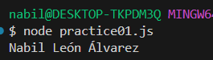

<div align="justify">

## Node - Dossier

- [Práctica 01](#práctica-01)
- [Práctica 02](#práctica-02)
- [Práctica 03](#práctica-03)
- [Práctica 04](#práctica-04)
- [Práctica 05](#práctica-05)
- [Práctica 06](#práctica-06)
- [Práctica 07](#práctica-07)
- [Práctica 08](#práctica-08)


***

### Práctica 01

> 📂
> Crear una aplicación que al ejecutar: node app.js
nos muestre en pantalla nuestro nombre completo
>

```javascript
console.log('Nabil León Álvarez');
```

- Captura:
<div align="center">

</div>

***

### Práctica 02

> 📂
> Hacer uso de nodemon con la app anterior
nodemon app.js
y comprobar que mientras editamos el fichero ( agregamos delante de nuestro nombre:
“nombre del alumno: ” ) y guardamos, automáticamente nos muestra la ejecución de los
cambios
>


- Captura:
<div align="center">

</div>

***


### Práctica 03

> 📂
> Crear la aplicación descrita
>

```javascript
function getTable(num){
    let limit = 10;
    let result = "";
    for(let i = 1; i <= limit; i++){
        result += `${num} * ${i} = ${num * i}\n`;;
    }
    
    return result;
}

console.log(getTable(4));
```

- Captura:
<div align="center">

</div>

***

### Práctica 04

> 📂
> Crear la aplicación descrita, pero si hay un error no mostrarlo sino mostrar un mensaje que diga que no se pudo grabar
>

```javascript
const fs = require(`fs`);

function getTable(num){
    let limit = 10;
    let result = "";
    for(let i = 1; i <= limit; i++){
        result += `${num} * ${i} = ${num * i}\n`;;
    }
    
    return result;
}


let num = 4;

fs.writeFile(
    'practice04.txt', getTable(num), (error)=>{
        if(error){
            console.log('No se pudo grabar el archivo');
        } else{
            console.log('Archivo creado con exito');
        }
    
    }
);


```

- Captura:
<div align="center">


</div>

***

### Práctica 05

> 📂
> Crear la aplicación descrita. El fichero: manejarTabla.js debe exportar un
método: escribir(nombreDelFichero, textoEscribir ) que tiene que devolver una promesa.
En el interior del método escribir() se llama a la función: fs.writeFileSync()
>

```javascript
function getTable(num){
    let limit = 10;
    let result = "";
    for(let i = 1; i <= limit; i++){
        result += `${num} * ${i} = ${num * i}\n`;;
    }
    
    return result;
}

module.exports.createTable = getTable;

const { rejects } = require("assert");
const fs = require(`fs`);


function write(fileName, content) {
    return new Promise((resolve, reject) => {
        try {
            fs.writeFileSync(fileName, content);
            resolve("File saved successfully");
        } catch (error) {
            console.error(error);
        }
    });
}


module.exports = {write};

const {write} = require("./utils/fileManagement");
const {createTable} = require("./model/table");

write("practice05.txt", createTable(7))
    .then(console.log("save ok"))
    .catch(err => console.log("error"));
    
```

- Captura:
<div align="center">


</div>

***

### Práctica 06

> 📂
> Variar la aplicación que tenemos para grabar una tabla en un fichero para que
le pasemos como parámetro el número del que queremos que nos haga la tabla
>

```javascript
function getTable(num){
    let limit = 10;
    let result = "";
    for(let i = 1; i <= limit; i++){
        result += `${num} * ${i} = ${num * i}\n`;;
    }
    
    return result;
}

module.exports.createTable = getTable;

const { rejects } = require("assert");
const fs = require(`fs`);


function write(fileName, content) {
    return new Promise((resolve, reject) => {
        try {
            fs.writeFileSync(fileName, content);
            resolve("File saved successfully");
        } catch (error) {
            reject(error);
        }
    });
}


module.exports = {write};


const {write} = require("./utils/fileManagement");
const {createTable} = require("./model/table");


function writeTableParam(){
    
    let num = parseInt(process.argv[2]);
    
    if(!Number.isInteger(num) || num <= 0){
        console.log("Error: You must use an integer and positive number.");
        process.exit(1);
    }

    write("practice06.txt", createTable(num))
    .then(console.log("save ok"))
    .catch(err => console.log("error"));
}


writeTableParam();
```

- Captura:
<div align="center">


</div>

***

### Práctica 07

> 📂
> Variar el ejercicio de la tabla con yargs y nos construya la tabla de un valor
( en el ejemplo vemos el 7 ) mediante:
node app --tabla=7
>

```javascript

function getTable(num){
    let limit = 10;
    let result = "";
    for(let i = 1; i <= limit; i++){
        result += `${num} * ${i} = ${num * i}\n`;;
    }
    
    return result;
}

module.exports.createTable = getTable;

const { rejects } = require("assert");
const fs = require(`fs`);


function write(fileName, content) {
    return new Promise((resolve, reject) => {
        try {
            fs.writeFileSync(fileName, content);
            resolve("File saved successfully");
        } catch (error) {
            reject(error);
        }
    });
}


module.exports = {write};

const {write} = require("./utils/fileManagement");
const {createTable} = require("./model/table");

const yargs = require("yargs/yargs");
const { hideBin } = require('yargs/helpers')
const argv = yargs(hideBin(process.argv)).argv

console.log(argv);


function writeTable(){
    write("practice07.txt", createTable(argv.table))
    .then(console.log("save ok"))
    .catch(err => console.log("error"));
}


writeTable();
```

- Captura:
<div align="center">


</div>

***

### Práctica 08

> 📂
> Crear el ejercicio descrito. Modificar el puerto al 8000 comprobar que arranca
correctamente y pasarle diferentes parámetros tomar captura de pantalla de lo obtenido
>

```javascript
const http = require('http');
const url = require('url');

const port=8200;

const server = http.createServer((req, res) => {
    res.write(`Server is running on port ${port}\n`);
    const queryObject = url.parse(req.url, true).query;
    console.log(queryObject);
    let text="";
    Object.entries(queryObject).forEach((par) => text += 
        (par[0]+": "+par[1]+"\n"));
    res.write(`param received: ${text}`);
    res.end();
}).listen(port);
```

- Captura:
<div align="center">


</div>

***

</div>