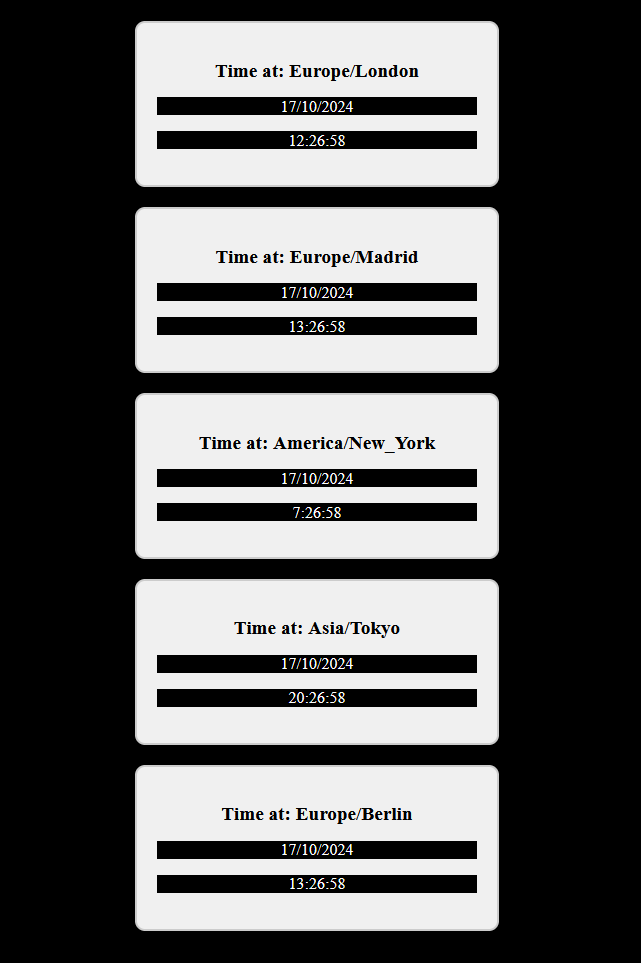

<div align="justify">

## React - Dossier

- [Práctica 01](#práctica-01)
- [Práctica 02](#práctica-02)
- [Práctica 03](#práctica-03)
- [Práctica 04](#práctica-04)
- [Práctica 05](#práctica-05)
- [Práctica 06](#práctica-06)
- [Práctica 07](#práctica-07)
- [Práctica 08](#práctica-08)
- [Práctica 09](#práctica-09)
- [Práctica 10](#práctica-10)
- [Práctica 11](#práctica-11)
- [Práctica 12](#práctica-12)
- [Práctica 13](#práctica-13)
- [Práctica 14](#práctica-14)
- [Práctica 15](#práctica-15)
- [Práctica 16](#práctica-16)
- [Práctica 17](#práctica-17)
- [Práctica 18](#práctica-18)
- [Práctica 19](#práctica-19)
- [Práctica 20](#práctica-20)


#### Extras:
- Example


***

### Práctica 01

> 📂
> Crear el hola mundo descrito y agrega tu nombre completo al h3 (usando npx para crear la app y npm start para arrancarla como se indica en el tema )
>

```code
function Practice01() {
  return (
    <div>
      <h3> Hello World! Nabil León Álvarez</h3>
    </div>
  );
}

export default Practice01;
```

- Captura:
<div align="center">

</div>

***
</br>

### Práctica 02

> 📂
> Realizar lo descrito y tomar captura de pantalla del mensaje en el navegador
>


- Captura:

<div align="center">

</div>

</br>

### Práctica 03

> 📂
> Reproducir el ejemplo anterior, pero en lugar de mostrar números primos en el h1 dirá: “mis datos:” y en el h4 le habremos pasado un objeto literal JSON con tu
nombre, apellidos y estudios que estás realizando
>

```code
const Practice03 = () => {
    const myData = {name: 'Nabil', 
                    surname: 'León Álvarez',
                    studies: 'DAM'};

    return (
        <>
        <h1>myData:</h1>
        <h4>{JSON.stringify(myData)}</h4>
        </>
    );
}

export default Practice03;
```

- Captura:

<div align="center">

</div>

</br>

### Práctica 04

> 📂
> Reproducir el ejemplo anterior, pero cambiando que los atributos que reciba
sean: num1 y num2 y lo que muestre es:
La suma de num1 y num2 es: num1 + num2
(donde num1 y num2 serían los datos que recibiera el componente )
>


```code
const Practice04 = (props) => {
    return (
            <>
            <h1>Sum:</h1>
            <p>La suma de {props.num1} y {props.num2} es: ({props.num1+props.num2})</p>
            </>
        );
    }
    Practice04.propTypes = {
            num1: PropTypes.number.isRequired,
            num2: PropTypes.number.isRequired
        }

export default Practice04;
```

- Captura:

<div align="center">

</div>

</br>

### Práctica 05

> 📂
> Reproducir el ejemplo anterior de componente con typescript, pero cambiando
que los atributos que reciba sean de tipo numérico: num1 y num2 y lo que muestre es:
La suma de num1 y num2 es: num1 + num2
(donde num1 y num2 serían los datos que recibiera el componente )
>

```code
type Props = {
    num1: number;
    num2: number;
}

const Practice05 = (props: Props) => {

    return (
            <p>
                La suma de {props.num1 ?? 0} y {props.num2 ?? 0} es: 
                {(props.num1) + (props.num2)}
            </p>
        );
    }

export default Practice05;

```

- Captura:

<div align="center">

</div>

</br>

### Práctica 06

> 📂
> Conseguir el renderizado anterior, generando el componente Reloj.ts
apropiado. Para ello generaremos el fichero: Reloj.ts y dentro estará el componente TSX
>

```code
type Props = {
    zone ?: string;
}

const Watch = (props: Props) => {
    const zoneStr = props.zone ?? "Europe/Madrid";
    const date = new Date().toLocaleDateString( "es-ES",{timeZone: zoneStr});
    const timeString = new Date().toLocaleTimeString("es-ES",{timeZone: zoneStr});
    return (
        <>
            <h2>Time at: {zoneStr}</h2>
            <p>{date}</p>
            <p>{timeString}</p>
        </>
    );
}

export default Watch;


type Props = {}


export const Practice06 = (props: Props) => {
  return (
    <>
    <h1>Actividad react: Relojes mundiales</h1>
    <Watch zone="Europe/Madrid" />
    <Watch zone="America/New_York" />
    <Watch zone="Europe/London" />
    </>
  )
}

export default Practice06;

```

- Captura:

<div align="center">

</div>

</br>

### Práctica 07

> 📂
> Probar el código anterior. Tomar captura de pantalla del navegador al pulsar el
botón
>


```code
const ComponenteApp = (props:any) => {
    const mostrarHora = ()=>{
    alert(new Date());
}
    return (
            <>
                <h1> Pulsar en el botón para ver la hora</h1>
                <button onClick={mostrarHora}>Pulsar</button>
            </>
);

}
export default ComponenteApp;
```

- Captura:

<div align="center">

</div>

</br>

### Práctica 08

> 📂
> Crear el código anterior de componente Contador en un fichero nuevo y cargar
en index.tsx en la parte de renderizado: ReactDOM.render() ese componente
Probarlo en el navegador y comprobar que efectivamente cambia el contador con los click
>


```code
class Practice08 extends Component {
    state = { count: 0 } 
    render () {
        const { count } = this.state 
    return (
            <div>
            <p>Has hecho click {count} veces</p>
            {  }
            <button onClick={() => this.setState({ count: count + 1 })}>
            Haz click!
            </button>
            </div>
        )
    }
}
export default Practice08;
```

- Captura:

<div align="center">

</div>

</br>

### Práctica 09

> 📂
> Realizar con el Hook useState dentro de un functional component un
componente que sirva a un usuario para prácticar la tabla del 2. Cada vez que pulse en el
botón se le mostrará la solución correcta de la tabla. Así:
la primera vez que haga clic se le mostrará:
2x1 = 2
La segunda vez:
2x2=4
y así sucesivamente.
En definitiva: que vaya mostrando la tabla del 2 a cada click
Observar que después de 2x10 mostrará 2x1
>

```code
type Props = {
    numTable : number;
}

const Practice09 = (props: Props) => {
    const [counter, increment] = useState(2);
    const numTable = props.numTable ?? 2;

    function incrementCounter(){
        if (counter === 10){
            increment(1);
        }
        increment(counter+1);
    }
    
    return (
            <>
                <div>
                    <h2>Tabla del {numTable}</h2>
                    <p>{numTable}*{counter} = {numTable*counter}</p>
                    <button onClick={incrementCounter}> {numTable}*{counter+1} = {numTable*(counter+1)} </button>
                </div>

            </>
    )
}

export default Practice09
```

- Captura:

<div align="center">

</div>

</br>

### Práctica 10

> 📂
> Crear un functional component react ( usa el snippet: tsrafc ) que tenga un
botón. Este botón al pulsarlo va agregando un nuevo número aleatorio de 0 a 100 de tal
forma que podemos ver gracias al state toda la lista de aleatorios generados ( Nota:
podemos usar: JSON.stringfy( nombredelarray ) para ver el array u otro objeto )
Nota: hay una forma sencilla de crear un nuevo array con un nuevo elemento conservando
los datos del anterior. Imaginemos que queremos agregar el número 5:
const arrayanterior: Array< any > = [4, 2, 7 ];
[ ...arrayanterior, 5 ]
>

```code
type Props = {}

const Practice10 = (props: Props) => {
    const [arraynum, setArraynum] = useState<Array<Number>>([]);

    function addNum(){
        const rndNum = Math.trunc(Math.random() * 100)+1;
        setArraynum( [...arraynum, rndNum]);
    }

  return (
    <>
        <div>
            <br></br>
            <p>{JSON.stringify(arraynum)}</p>
            <button onClick={addNum}> Add num </button>
        </div>

    </>
    
  )
}

export default Practice10
```

- Captura:

<div align="center">

</div>

</br>


### Práctica 11

> 📂
> Crear el anterior functional component, ejecútalo y abre la consola ¿ se está
actualizando la información del atributo estático ? ¿ y de la variable: dato ? Ahora quita el
comentario de la línea: sethoraactual(“” + new Date());
Sabemos que de esa manera al actualizar el state se fuerza un nuevo renderizado ¿ se está
actualizando la info del atributo estático ? ¿ y de la variable: dato ?
>


```code
type Props = {}

const Practice11 = (props: Props) => {
  const [currentDate, setCurrentDate] = useState("");

  let data = 1;

  function update(){
    Practice11.staticAtt++;
    data++;
    console.log("static attribute: " + Practice11.staticAtt);
    console.log("data: " + data);
    //setCurrentDate("" + new Date());
  }


  return (
      <div>
        <h4>Static component</h4>
        <p>Static's info: {Practice11.staticAtt}</p>
        <button onClick={update}> Update</button>
      </div>
  )
}

Practice11.staticAtt = 2;

export default Practice11
```

- Captura:

<div align="center">

</div>

```code
type Props = {}

const Practice11 = (props: Props) => {
  const [currentDate, setCurrentDate] = useState("");

  let data = 1;

  function update(){
    Practice11.staticAtt++;
    data++;
    console.log("static attribute: " + Practice11.staticAtt);
    console.log("data: " + data);
    setCurrentDate("" + new Date());
  }


  return (
      <div>
        <h4>Static component</h4>
        <p>Static's info: {Practice11.staticAtt}</p>
        <button onClick={update}> Update</button>
      </div>
  )
}

Practice11.staticAtt = 2;

export default Practice11
```

- Captura:

<div align="center">

</div>


</br>

### Práctica 12

> 📂
> Crear la actividad que se acaba de describir. Notar que hay que usar un
useState para que muestre un texto u otro según lo que se haya pulsado
>

```code
type Props = {}

const Practice12 = (props: Props) => {
    const [color, setColor] = useState("");
    function selectColor(color: string) {
      setColor(color)
    }

  return (
    <>
        <h2>Select color:</h2>
        <p id="selected">You have selected: {color}</p>
        <button onClick={()=>selectColor("Red")} id="btnRed">Red</button>
        <button onClick={()=>selectColor("Green")} id="btnGreen">Green</button>
    </>
  )
}

export default Practice12
```


- Captura:

<div align="center">


</div>

</br>

### Práctica 13

> 📂
> Reproducir el ejemplo anterior en la aplicación monedas. Hacer que los li
no muestren únicamente el nombre de la moneda sino también el país. Ej:
li libra de UK /li
>

```code
type Props = {}

type Moneda = {
  nombre: string,
  pais: string
}

const Practice13 = (props: Props) => {
  const [monedas, setMonedas] = useState<Array<Moneda>>([]);

  function addMoneda() {
    const moneda: Moneda = {
      nombre: "libra",
      pais: "UK"
    }
    setMonedas([...monedas, moneda]);
  }

  return (
    <>
      <h3>Cliente de monedas</h3>
      <div>
        <button onClick={addMoneda}>
          Agregar moneda
        </button>
        <h4>Monedas:</h4>
        <ul>
          {
            monedas.map((m: Moneda, index: number) => {
              return (
                <li key={index}> {m.nombre} de {m.pais} </li>
              );
            })
          }
        </ul>
      </div>
    </>
  );
}

export default Practice13;
```

- Captura:

<div align="center">

</div>

</br>


### Práctica 14

> 📂
> Crear un componente: TodasLasTablas que use el componente ya creado Así
muestra las tablas del 2 al 10 ( mirar imagen ejemplo )
Se usarán las pros: <PracticarTabla tabla={5} /> → Esto genera la tabla del 5. Usar un
map para un array [2,3,..,10] y establece para cada componente PracticarTabla el prop para
su tabla
>

```code
type Props = {}

const Practice14 = (props: Props) => {
    const arr = [2,3,4,5,6,7,8,9,10];

    return (
    <div className='grid-tables'>
        {
            arr.map(num => {
                    return <div className='table'><Practice09 key={num} numTable={num}/></div>
            }      
        )}
    </div> 

  )
}

export default Practice14
```

- Captura:

<div align="center">

</div>

</br>


### Práctica 15

> 📂
> Crear el renderizado anterior. Al pulsar en botón rojo el área tiene color fuente rojo y borde
rojo. Si se pulsa en verde, pues en verde, y así con todos. Se recomienda crear las 4 clases
CSS y luego que se establezcan mediante:
<h4 className={claseaplicada}>Este area muestra los resultados de los botones </h4>
>

- CSS:
```code
.red{
    color: red;
    border: 2px solid red;
}

.blue{
    color: blue;
    border: 2px solid blue;
}

.green{
    color: green;
    border: 2px solid green;
}

.pink{
    color: pink;
    border: 2px solid pink;
}
```

```code
import React, { useState } from 'react'
import './practice15.css'
type Props = {}

const Practice15 = (props: Props) => {
  const [color, setColor] = useState("");
  
    function selectColor(color: string) {
      setColor(color)
    }

    return (
        <>
            <h2> Botones y CSS</h2>
            <p className={color}>Este es el area que muestra los resultados de los botones</p>
            <button id="green" onClick={()=>selectColor("green")}>Verde</button>     
            <button id="blue" onClick={()=>selectColor("blue")}>Azul</button>     
            <button id="red" onClick={()=>selectColor("red")}>Rojo</button>     
            <button id="pink" onClick={()=>selectColor("pink")}>Rosa</button>     

        </>
     )
}

export default Practice15
```


- Captura:

<div align="center">


</div>

</br>

### Práctica 16

> 📂
> En la práctica de los relojes de zonas horarias, crear un array con 5 zonas
horarias, entre ellas: Londres, Madrid y usando array.map generar los 5 componentes Reloj
con su respectiva propiedad timezone, dándole estilos CSS a los componentes
>

- CSS:
```code
body{
    background-color: #000;
}

.watch-list {
    display: flex;
    justify-content: space-around;
    flex-wrap: wrap;
    margin: 1.2rem;
}

.watch-item {
    border: 2px solid #ccc;
    border-radius: 10px;
    padding: 20px;
    margin: 10px;
    text-align: center;
    background-color: #f0f0f0;
    width: 20rem;
}

.watch-item h2 {
    background-color: #f0f0f0;
    color: #000;
    font-size: 1.2rem;
}

.watch-item p {
    font-size: 1rem;
}

.watch-container {
    padding: 16.2px;
}
```

```code
type Props = {}

const Practice16 = (props: Props) => {
    const array = ["Europe/London", "Europe/Madrid",  "America/New_York", "Asia/Tokyo", "Europe/Berlin" ];
  return (
    <>
        <div className="watch-list">
            {array.map((zone, key) => (
                <div className="watch-item" key={key}>
                    <Watch zone={zone} />
                </div>
            ))}
        </div>
    </>
    
  )
}

export default Practice16
```


- Captura:

<div align="center">

</div>

</br>

### Práctica 17

> 📂
> Crear un componente que tenga dos botones. Cuando se pulse en el primer
botón se cargará un componente que mostrará 10 números aleatorios de 0 a 100 a pulsar un
botón llamado “generar” que esté dentro del componente
Si se pulsa en el otro botón se carga otro componente que reemplaza el anterior que muestra
un saludo y la fecha actual ( la fecha se enviará mediante props )
>

- Greeting:

```code
type Props = {
    date ?: string
}

function Greeting(props: Props) {
    const dateStr = props.date ?? "no date provided" ;
  return (
    <>
        <h1> Greetings! </h1>z
        <p>Hello, today is {dateStr}</p>
    </>
  )
}

export default Greeting
```


```code
type Props = {}

const Practice17 = (props: Props) => {
    const [showRndNum, setRndNum] = useState(true);

    return (
    <>
        {showRndNum? <RndNumberComponent/> : <GreetingComponent/>}
        <button onClick={()=> setRndNum(true)}>Generate</button>
        <button onClick={()=>setRndNum(false)}>Greeting</button>
    </>
    
  )
}


const RndNumberComponent = (props: Props) =>{    
    const [arraynum, setArraynum] = useState<Array<Number>>([]);

    function generateRndNums(){
        let auxArr : number [] = [];

        for (let i = 0; i < 10; i++) {
            const rndNum = Math.trunc(Math.random() * 100)+1;
            auxArr.push(rndNum);
        }
        setArraynum(auxArr);
    }

    useEffect(() => {
        generateRndNums(); 
      }, []);

    return (
        <>
            <h2>Random Numbers</h2>
            <p>{JSON.stringify(arraynum)}</p>
        </>
    )
}


const GreetingComponent = (props: Props) =>{
    return (
        <>
            <Greeting date="2024-10-13"/>
        </>
    )
}


export default Practice17
```

- Captura:

<div align="center">


</div>

</br>

### Práctica 18

> 📂
> Realizar los dos ejemplos anteriores ( FuntionalComponent con useEffect() y
React.Component con los métodos componentDidMount() componentDidUpdate()).
Adaptarlos a React con Typescript
>

- v1:

```code
import React from 'react';

class Practice18ReactComponent extends React.Component<{}, { count: number }> {
  constructor(props: {}) {
    super(props);
    this.state = {
      count: 0
    };
  }

  componentDidMount() {
    document.title = `You clicked ${this.state.count} times`;
  }

  componentDidUpdate() {
    document.title = `You clicked ${this.state.count} times`;
  }

  render() {
    return (
      <div>
        <p>You clicked {this.state.count} times</p>
        <button onClick={() => this.setState({ count: this.state.count + 1 })}>
          Click me
        </button>
      </div>
    );
  }
}

export default Practice18ReactComponent;
```

- Captura:

<div align="center">

</div>


- v2:

```code
type Props = {}

const Practice18 = (props: Props) => {
    const [count, setCount] = useState<number>(0);
    useEffect(() => {
        document.title = `You clicked ${count} times`;
      }, [count]);

  return (
    <>
        <div>
            <p>You clicked {count} times</p>
            <button onClick={() => setCount(count + 1)}>
                Click me
            </button>
        </div>
    </>
  )
}


export default Practice18
```

- Captura:

<div align="center">

</div>

</br>

### Práctica 19

> 📂
>  Abriendo la consola para ver los mensajes de log, ejecutar el código anterior.
¿ se muestra la fecha cada vez que se renderiza ( modifica el estado ) ? ¿ el contador
empieza en qué número ?
Ahora modifica el código anterior quitando los comentarios en la línea: //setContador(-1)
¿ qué ocurre ahora ? ¿ En el primer renderizado ( antes de pulsar el botón) qué muestra el
contador? ¿Y después de ejecutar el botón?
Sigue modificando el código quitando los comentarios en el array de useEffect quedando la
línea final del useEffect() así:
}, [] )
¿ se ejecuta es useEffect() en cada renderizado ? ¿ se ejecuta en el momento del montaje ?
Finalmente vamos a dejar nuestro useEffect así:
useEffect(() => {
const efecto = () =>{
let fecha = new Date();
console.log(fecha);
setcontador(-1);
}
efecto();
}, [contador>10] )
Ahora ¿cuándo se ejecuta el useEffect
>

La fecha se muestra cada vez que se renderiza así cómo el contador.

- v1:

```code

type Props = {}

const Practice19 = (props: Props) => {
    const [contador, setcontador] = useState<number>(100);
    useEffect(() => {
        const efecto = () =>{
            let fecha = new Date();
            console.log(fecha);
            //setcontador(-1);
        }
        efecto();
    },/*[]*/ )
    
    return (
        <div>
        <h3>info en state: {contador}</h3>
        <button onClick={() => setcontador(contador + 1)}>Actualizar state</button>
        </div>
    )
}
export default Practice19
```

- Captura:

<div align="center">

</div>

- v2:

Tras quitar el comentario, observamos que el contador no se actualiza. Además, cuando renderiza imprime 2 veces la fecha.

```code
const Practice19 = (props: Props) => {
    const [contador, setcontador] = useState<number>(100);
    useEffect(() => {
        const efecto = () =>{
            let fecha = new Date();
            console.log(fecha);
            setcontador(-1);
        }
        efecto();
    },/*[]*/ )
    
    return (
        <div>
        <h3>info en state: {contador}</h3>
        <button onClick={() => setcontador(contador + 1)}>Actualizar state</button>
        </div>
    )
}
```

- Captura:

<div align="center">

</div>

- v3:

Tras quitar el comentario de [], el useEffect se ejectu una sola vez cuando el componente se monta antes del primer renderizado.

```code
const Practice19 = (props: Props) => {
    const [contador, setcontador] = useState<number>(100);
    useEffect(() => {
        const efecto = () =>{
            let fecha = new Date();
            console.log(fecha);
            setcontador(-1);
        }
        efecto();
    },/*[]*/ )
    
    return (
        <div>
        <h3>info en state: {contador}</h3>
        <button onClick={() => setcontador(contador + 1)}>Actualizar state</button>
        </div>
    )
}
```

- Captura:

<div align="center">

</div>


- v4:

Con este cambio, el useEffect se ejecutara cada vez que se cumpla la condicion de contador>10 sea true.

```code
type Props = {}

const Practice19 = (props: Props) => {
    const [contador, setcontador] = useState<number>(100);
    useEffect(() => {
        const efecto = () =>{
            let fecha = new Date();
            console.log(fecha);
            setcontador(-1);
        }
        efecto();
    },[contador>10])
    
    return (
        <div>
        <h3>info en state: {contador}</h3>
        <button onClick={() => setcontador(contador + 1)}>Actualizar state</button>
        </div>
    )
}
export default Practice19
```

- Captura:

<div align="center">

</div>

</br>

### Práctica 20

> 📂
> Realizar un componente para el juego de Acertar número secreto ( de 0 a 9 ).
Tendremos 10 botones siguiendo el patrón:
<button onClick=”{()=>apostar(7)}” > 7 </button>
Al montarse el componente se genera el número
aleatorio secreto, que permanecerá sin modificación
hasta que el usuario acierte el número. Cuando se pulsa
en los botones de apuesta se informa al usuario de si ha
acertado, si el número es menor o mayor que secreto
>


```code
type Props = {}

const Practice20 = (props: Props) => {
    let arr = [0,1,2,3,4,5,6,7,8,9];
    const [restart, setRestart] = useState(true);
    const [numBet, setNumBet] = useState(0);
    const [win, setWin] = useState(false);
    const [message, setMessage] = useState('');


    useEffect(() => {
      const generateNum = () => {
        const rndNum = Math.trunc(Math.random() * arr.length );
        setNumBet(rndNum);
      }

      if (restart) {
        generateNum();
        setRestart(false); 
      }
      console.log(numBet);
    }, [restart]);


    const handleClick = (num: number) => {
        if (num === numBet) { 
          setWin(true);
          setMessage (`You won! Num was ${numBet}`);
        } else if(num > numBet){
          setMessage (`${num} > hidden number`);
        } else {
          setMessage (`${num} < hidden number`);
        }
    }
    
    const restartGame = () =>{
      setRestart(true);
      setMessage('');
      setWin(false);
    }

  return (
    <>
        <h2>Guess num:</h2>
        {arr.map(num => {
            return <button key={num} onClick={() => handleClick(num)}> {num}</button>
        })}
        <button onClick={restartGame}>Restart</button>

        <p>{message}</p>

        {win && <p>Congratulations! You guessed the number correctly.</p>}

        
     
    </>
  )
}

export default Practice20
```
- Captura:

<div align="center">


</div>

</br>

### Práctica 28

> 📂
> Realizar un componente llamado: MostrarInput que se introduzca el
texto en el input y se vaya mostrando en un h5
>


```code
const Practice28 = (props: Props) => {
  const [text, setText] = useState<String>("");
  

  function handleChanges(event:ChangeEvent<HTMLInputElement>){
    event.preventDefault();
    setText(event.target.value);
  }

    return (
    <>
        <label htmlFor="name"></label>
        <input type="text" id="name" onChange={handleChanges}/>
        <br/>
        <h5>You wrote: {text} </h5>
    </>
  )
}

export default Practice28
```
- Captura:

<div align="center">

</div>

</br>

### Práctica 29

> 📂
> Realizar un componente llamado:
OperarBotones que al pulsar el botón de la izquierda
divida al valor actual entre 2 y si se pulsa el de la derecha
multiplique. Se debe hacer mediante un único método que responda a onClick ( el mismo
método para los dos botones )
>


```code
function Practica29({}: Props) {
    const [num, setnum] = useState<number>(1);
    

    function handleClick(event:React.MouseEvent<HTMLButtonElement>){
        event.preventDefault();
        
        if(event.currentTarget.innerText.includes("*")){
            setnum(num*2);
        } else if(event.currentTarget.innerText.includes("/")){
            setnum(num/2);
        }
        
    }

    return (
    <>
        <h5>Current num: {num} </h5>
        <button onClick={handleClick}>{num}*2</button>
        <button onClick={handleClick}>{num}/2</button>
        <br/>
    </>
    )
  }

export default Practica29
```
- Captura:

<div align="center">


</div>

</br>

### Práctica 30

> 📂
> Implementaremos el juego de acertar número secreto. Pero en esta ocasión,
habrá un input y un botón. Al pulsar el botón el programa evalúa la apuesta del input. NO se
usarán referencias. Se hará el uso de manejo de eventos para acceso al DOM
>


```code
const Practice30 = (props: Props) => {
    const [historic, sethistoric] = useState<string []>([]);
    const [num, setnum] = useState<number>(0);
    const [game, setgame] = useState<Game>({} as Game);

    useEffect(() => {
      setgame(new Game(10));
    }, [])


    const getInputValue = (event:ChangeEvent<HTMLInputElement>) =>{
        event.preventDefault();
        setnum(parseInt(event.currentTarget.value));
    } 


    function betGame (event:React.MouseEvent<HTMLButtonElement>){
        event.preventDefault();
        game.bet(num);
        let historicUpdate = game.getHistory();
        sethistoric([... historicUpdate]);
    }
    
  return (
        <>
            <h4>Guess num</h4>
            <input type="text" id="numbet" onChange={getInputValue}/>
            <button type='button' onClick={betGame}>Bet</button>
            {historic}
        </>
    )
}

export default Practice30
```
- Captura:

<div align="center">


</div>

</br>

### Práctica 31

> 📂
> Realizar un componente react: Memoria8.tsx que
realice el juego de memorizar de forma ordenada 8 números.
Durante 3 segundos se le muestra al usuario los 8 números y
luego se ocultan ( vale mostrar cualquier otra cosa ) Luego el
usuario irá pulsando en los botones. Primero debe pulsar el botón
que incluye el 1, si pulsa en la casilla que lo tiene se le muestra y
ya queda para siempre, en otro caso no muestra nada. Luego lo
mismo con el que incluye el 2, etc. Cada pulsación de botón aumenta un contador
>


```code
type Props = {}

const Practice31 = (props: Props) => {
    /**
     * UseStates
     */
    const [numberArray, setNumberArray] = useState<number[]>([]);
    const [revealedNumbers, setrevealedNumbers] = useState<number[]>([]);
    const [currentNumber, setCurrentNumber] = useState<number>(1); 
    const [attempts, setAttempts] = useState<number>(0);
    const [isShowing, setIsShowing] = useState<boolean>(true);
    const [isGameOver, setIsGameOver] = useState<boolean>(false);

    const numValuesArray = [1,2,3,4,5,6,7,8];

    useEffect(() => {
        setIsGameOver(false);
        generateNumbers();
    }, [isGameOver]);


    /**
     * Function to generate shuffle numbers
     */
    function generateNumbers() {
        const shuffleNumArray = [...numValuesArray];

        for (let i = 0; i < shuffleNumArray.length; i++){
            const j = Math.floor(Math.random() * (i + 1));
            [shuffleNumArray[i], shuffleNumArray[j]] = [shuffleNumArray[j], shuffleNumArray[i]];
        }
        
        setNumberArray(shuffleNumArray);

        setTimeout(() =>{
            setIsShowing(false);
        }, 3000)
    }

    /**
     * Function to handle the users choice
     * @param index of the button
     */

    function handleClick(index : number){
        if (revealedNumbers.includes(numberArray[index])) {
            return;
        }

        setAttempts(attempts+1);

        if (numberArray[index] === currentNumber){
            const updatedRevealedNumbers = [...revealedNumbers, numberArray[index]];
            setrevealedNumbers(updatedRevealedNumbers);
            setCurrentNumber(currentNumber+1);
            
            if(updatedRevealedNumbers.length === numValuesArray.length){
                alert("Congratulations, you won!");
                setTimeout(() => {
                    endGame();
                }, 2500);
            }


        }

    }

    /**
     * Function to end and restart the game
     */
    function endGame(){
        setIsGameOver(true);
        setrevealedNumbers([]); 
        setCurrentNumber(1); 
        setAttempts(0);
        setIsShowing(true); 
    }

  return (
        <>
        <div className='main-container'>
            <h2>Memory Game</h2>
            <p>Attemps: {attempts}</p>
            <div className='btn-container'>
                {numberArray.map((num, index) => (
                    <button key={index} onClick={() => handleClick(index)}>
                        {isShowing || revealedNumbers.includes(num) ? num : "?"}                    
                    </button>
                ))}

            </div>
        </div>
        </>
  )
}

export default Practice31
```
- Captura:

<div align="center">


</div>

</br>

</div>