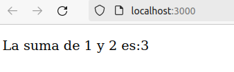
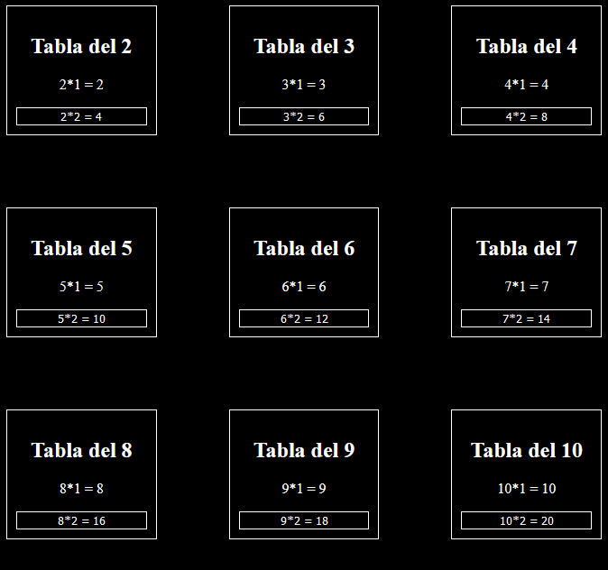
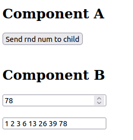

<div align="justify">

## React - Dossier

- [Práctica 01](#práctica-01)
- [Práctica 02](#práctica-02)
- [Práctica 03](#práctica-03)
- [Práctica 04](#práctica-04)
- [Práctica 05](#práctica-05)
- [Práctica 06](#práctica-06)
- [Práctica 07](#práctica-07)
- [Práctica 08](#práctica-08)
- [Práctica 09](#práctica-09)
- [Práctica 10](#práctica-10)
- [Práctica 11](#práctica-11)
- [Práctica 12](#práctica-12)
- [Práctica 13](#práctica-13)
- [Práctica 14](#práctica-14)
- [Práctica 15](#práctica-15)
- [Práctica 16](#práctica-16)
- [Práctica 17](#práctica-17)
- [Práctica 18](#práctica-18)
- [Práctica 19](#práctica-19)
- [Práctica 20](#práctica-20)


#### Extras:
- Example


***

### Práctica 01

> 📂
> Crear el hola mundo descrito y agrega tu nombre completo al h3 (usando npx para crear la app y npm start para arrancarla como se indica en el tema )
>

```javascript
function Practice01() {
  return (
    <div>
      <h3> Hello World! Nabil León Álvarez</h3>
    </div>
  );
}

export default Practice01;
```

- Captura:
<div align="center">

</div>

***
</br>

### Práctica 02

> 📂
> Realizar lo descrito y tomar captura de pantalla del mensaje en el navegador
>


- Captura:

<div align="center">

</div>

</br>

### Práctica 03

> 📂
> Reproducir el ejemplo anterior, pero en lugar de mostrar números primos en el h1 dirá: “mis datos:” y en el h4 le habremos pasado un objeto literal JSON con tu
nombre, apellidos y estudios que estás realizando
>

```javascript
const Practice03 = () => {
    const myData = {name: 'Nabil', 
                    surname: 'León Álvarez',
                    studies: 'DAM'};

    return (
        <>
        <h1>myData:</h1>
        <h4>{JSON.stringify(myData)}</h4>
        </>
    );
}

export default Practice03;
```

- Captura:

<div align="center">

</div>

</br>

### Práctica 04

> 📂
> Reproducir el ejemplo anterior, pero cambiando que los atributos que reciba
sean: num1 y num2 y lo que muestre es:
La suma de num1 y num2 es: num1 + num2
(donde num1 y num2 serían los datos que recibiera el componente )
>


```javascript
const Practice04 = (props) => {
    return (
            <>
            <h1>Sum:</h1>
            <p>La suma de {props.num1} y {props.num2} es: ({props.num1+props.num2})</p>
            </>
        );
    }
    Practice04.propTypes = {
            num1: PropTypes.number.isRequired,
            num2: PropTypes.number.isRequired
        }

export default Practice04;
```

- Captura:

<div align="center">

</div>

</br>

### Práctica 05

> 📂
> Reproducir el ejemplo anterior de componente con typescript, pero cambiando
que los atributos que reciba sean de tipo numérico: num1 y num2 y lo que muestre es:
La suma de num1 y num2 es: num1 + num2
(donde num1 y num2 serían los datos que recibiera el componente )
>

```javascript
type Props = {
    num1: number;
    num2: number;
}

const Practice05 = (props: Props) => {

    return (
            <p>
                La suma de {props.num1 ?? 0} y {props.num2 ?? 0} es: 
                {(props.num1) + (props.num2)}
            </p>
        );
    }

export default Practice05;

```

- Captura:

<div align="center">

</div>

</br>

### Práctica 06

> 📂
> Conseguir el renderizado anterior, generando el componente Reloj.ts
apropiado. Para ello generaremos el fichero: Reloj.ts y dentro estará el componente TSX
>

```javascript
type Props = {
    zone ?: string;
}

const Watch = (props: Props) => {
    const zoneStr = props.zone ?? "Europe/Madrid";
    const date = new Date().toLocaleDateString( "es-ES",{timeZone: zoneStr});
    const timeString = new Date().toLocaleTimeString("es-ES",{timeZone: zoneStr});
    return (
        <>
            <h2>Time at: {zoneStr}</h2>
            <p>{date}</p>
            <p>{timeString}</p>
        </>
    );
}

export default Watch;


type Props = {}


export const Practice06 = (props: Props) => {
  return (
    <>
    <h1>Actividad react: Relojes mundiales</h1>
    <Watch zone="Europe/Madrid" />
    <Watch zone="America/New_York" />
    <Watch zone="Europe/London" />
    </>
  )
}

export default Practice06;

```

- Captura:

<div align="center">

</div>

</br>

### Práctica 07

> 📂
> Probar el código anterior. Tomar captura de pantalla del navegador al pulsar el
botón
>


```javascript
const ComponenteApp = (props:any) => {
    const mostrarHora = ()=>{
    alert(new Date());
}
    return (
            <>
                <h1> Pulsar en el botón para ver la hora</h1>
                <button onClick={mostrarHora}>Pulsar</button>
            </>
);

}
export default ComponenteApp;
```

- Captura:

<div align="center">

</div>

</br>

### Práctica 08

> 📂
> Crear el código anterior de componente Contador en un fichero nuevo y cargar
en index.tsx en la parte de renderizado: ReactDOM.render() ese componente
Probarlo en el navegador y comprobar que efectivamente cambia el contador con los click
>


```javascript
class Practice08 extends Component {
    state = { count: 0 } 
    render () {
        const { count } = this.state 
    return (
            <div>
            <p>Has hecho click {count} veces</p>
            {  }
            <button onClick={() => this.setState({ count: count + 1 })}>
            Haz click!
            </button>
            </div>
        )
    }
}
export default Practice08;
```

- Captura:

<div align="center">

</div>

</br>

### Práctica 09

> 📂
> Realizar con el Hook useState dentro de un functional component un
componente que sirva a un usuario para prácticar la tabla del 2. Cada vez que pulse en el
botón se le mostrará la solución correcta de la tabla. Así:
la primera vez que haga clic se le mostrará:
2x1 = 2
La segunda vez:
2x2=4
y así sucesivamente.
En definitiva: que vaya mostrando la tabla del 2 a cada click
Observar que después de 2x10 mostrará 2x1
>

```javascript
type Props = {
    numTable : number;
}

const Practice09 = (props: Props) => {
    const [counter, increment] = useState(2);
    const numTable = props.numTable ?? 2;

    function incrementCounter(){
        if (counter === 10){
            increment(1);
        }
        increment(counter+1);
    }
    
    return (
            <>
                <div>
                    <h2>Tabla del {numTable}</h2>
                    <p>{numTable}*{counter} = {numTable*counter}</p>
                    <button onClick={incrementCounter}> {numTable}*{counter+1} = {numTable*(counter+1)} </button>
                </div>

            </>
    )
}

export default Practice09
```

- Captura:

<div align="center">

</div>

</br>

### Práctica 10

> 📂
> Crear un functional component react ( usa el snippet: tsrafc ) que tenga un
botón. Este botón al pulsarlo va agregando un nuevo número aleatorio de 0 a 100 de tal
forma que podemos ver gracias al state toda la lista de aleatorios generados ( Nota:
podemos usar: JSON.stringfy( nombredelarray ) para ver el array u otro objeto )
Nota: hay una forma sencilla de crear un nuevo array con un nuevo elemento conservando
los datos del anterior. Imaginemos que queremos agregar el número 5:
const arrayanterior: Array< any > = [4, 2, 7 ];
[ ...arrayanterior, 5 ]
>

```javascript
type Props = {}

const Practice10 = (props: Props) => {
    const [arraynum, setArraynum] = useState<Array<Number>>([]);

    function addNum(){
        const rndNum = Math.trunc(Math.random() * 100)+1;
        setArraynum( [...arraynum, rndNum]);
    }

  return (
    <>
        <div>
            <br></br>
            <p>{JSON.stringify(arraynum)}</p>
            <button onClick={addNum}> Add num </button>
        </div>

    </>
    
  )
}

export default Practice10
```

- Captura:

<div align="center">

</div>

</br>


### Práctica 11

> 📂
> Crear el anterior functional component, ejecútalo y abre la consola ¿ se está
actualizando la información del atributo estático ? ¿ y de la variable: dato ? Ahora quita el
comentario de la línea: sethoraactual(“” + new Date());
Sabemos que de esa manera al actualizar el state se fuerza un nuevo renderizado ¿ se está
actualizando la info del atributo estático ? ¿ y de la variable: dato ?
>


```javascript
type Props = {}

const Practice11 = (props: Props) => {
  const [currentDate, setCurrentDate] = useState("");

  let data = 1;

  function update(){
    Practice11.staticAtt++;
    data++;
    console.log("static attribute: " + Practice11.staticAtt);
    console.log("data: " + data);
    //setCurrentDate("" + new Date());
  }


  return (
      <div>
        <h4>Static component</h4>
        <p>Static's info: {Practice11.staticAtt}</p>
        <button onClick={update}> Update</button>
      </div>
  )
}

Practice11.staticAtt = 2;

export default Practice11
```

- Captura:

<div align="center">

</div>

```javascript
type Props = {}

const Practice11 = (props: Props) => {
  const [currentDate, setCurrentDate] = useState("");

  let data = 1;

  function update(){
    Practice11.staticAtt++;
    data++;
    console.log("static attribute: " + Practice11.staticAtt);
    console.log("data: " + data);
    setCurrentDate("" + new Date());
  }


  return (
      <div>
        <h4>Static component</h4>
        <p>Static's info: {Practice11.staticAtt}</p>
        <button onClick={update}> Update</button>
      </div>
  )
}

Practice11.staticAtt = 2;

export default Practice11
```

- Captura:

<div align="center">

</div>


</br>

### Práctica 12

> 📂
> Crear la actividad que se acaba de describir. Notar que hay que usar un
useState para que muestre un texto u otro según lo que se haya pulsado
>

```javascript
type Props = {}

const Practice12 = (props: Props) => {
    const [color, setColor] = useState("");
    function selectColor(color: string) {
      setColor(color)
    }

  return (
    <>
        <h2>Select color:</h2>
        <p id="selected">You have selected: {color}</p>
        <button onClick={()=>selectColor("Red")} id="btnRed">Red</button>
        <button onClick={()=>selectColor("Green")} id="btnGreen">Green</button>
    </>
  )
}

export default Practice12
```


- Captura:

<div align="center">


</div>

</br>

### Práctica 13

> 📂
> Reproducir el ejemplo anterior en la aplicación monedas. Hacer que los li
no muestren únicamente el nombre de la moneda sino también el país. Ej:
li libra de UK /li
>

```javascript
type Props = {}

type Moneda = {
  nombre: string,
  pais: string
}

const Practice13 = (props: Props) => {
  const [monedas, setMonedas] = useState<Array<Moneda>>([]);

  function addMoneda() {
    const moneda: Moneda = {
      nombre: "libra",
      pais: "UK"
    }
    setMonedas([...monedas, moneda]);
  }

  return (
    <>
      <h3>Cliente de monedas</h3>
      <div>
        <button onClick={addMoneda}>
          Agregar moneda
        </button>
        <h4>Monedas:</h4>
        <ul>
          {
            monedas.map((m: Moneda, index: number) => {
              return (
                <li key={index}> {m.nombre} de {m.pais} </li>
              );
            })
          }
        </ul>
      </div>
    </>
  );
}

export default Practice13;
```

- Captura:

<div align="center">

</div>

</br>


### Práctica 14

> 📂
> Crear un componente: TodasLasTablas que use el componente ya creado Así
muestra las tablas del 2 al 10 ( mirar imagen ejemplo )
Se usarán las pros: <PracticarTabla tabla={5} /> → Esto genera la tabla del 5. Usar un
map para un array [2,3,..,10] y establece para cada componente PracticarTabla el prop para
su tabla
>

```javascript
type Props = {}

const Practice14 = (props: Props) => {
    const arr = [2,3,4,5,6,7,8,9,10];

    return (
    <div className='grid-tables'>
        {
            arr.map(num => {
                    return <div className='table'><Practice09 key={num} numTable={num}/></div>
            }      
        )}
    </div> 

  )
}

export default Practice14
```

- Captura:

<div align="center">

</div>

</br>


### Práctica 15

> 📂
> Crear el renderizado anterior. Al pulsar en botón rojo el área tiene color fuente rojo y borde
rojo. Si se pulsa en verde, pues en verde, y así con todos. Se recomienda crear las 4 clases
CSS y luego que se establezcan mediante:
<h4 className={claseaplicada}>Este area muestra los resultados de los botones </h4>
>

- CSS:
```javascript
.red{
    color: red;
    border: 2px solid red;
}

.blue{
    color: blue;
    border: 2px solid blue;
}

.green{
    color: green;
    border: 2px solid green;
}

.pink{
    color: pink;
    border: 2px solid pink;
}
```

```javascript
import React, { useState } from 'react'
import './practice15.css'
type Props = {}

const Practice15 = (props: Props) => {
  const [color, setColor] = useState("");
  
    function selectColor(color: string) {
      setColor(color)
    }

    return (
        <>
            <h2> Botones y CSS</h2>
            <p className={color}>Este es el area que muestra los resultados de los botones</p>
            <button id="green" onClick={()=>selectColor("green")}>Verde</button>     
            <button id="blue" onClick={()=>selectColor("blue")}>Azul</button>     
            <button id="red" onClick={()=>selectColor("red")}>Rojo</button>     
            <button id="pink" onClick={()=>selectColor("pink")}>Rosa</button>     

        </>
     )
}

export default Practice15
```


- Captura:

<div align="center">


</div>

</br>

### Práctica 16

> 📂
> En la práctica de los relojes de zonas horarias, crear un array con 5 zonas
horarias, entre ellas: Londres, Madrid y usando array.map generar los 5 componentes Reloj
con su respectiva propiedad timezone, dándole estilos CSS a los componentes
>

- CSS:
```javascript
body{
    background-color: #000;
}

.watch-list {
    display: flex;
    justify-content: space-around;
    flex-wrap: wrap;
    margin: 1.2rem;
}

.watch-item {
    border: 2px solid #ccc;
    border-radius: 10px;
    padding: 20px;
    margin: 10px;
    text-align: center;
    background-color: #f0f0f0;
    width: 20rem;
}

.watch-item h2 {
    background-color: #f0f0f0;
    color: #000;
    font-size: 1.2rem;
}

.watch-item p {
    font-size: 1rem;
}

.watch-container {
    padding: 16.2px;
}
```

```javascript
type Props = {}

const Practice16 = (props: Props) => {
    const array = ["Europe/London", "Europe/Madrid",  "America/New_York", "Asia/Tokyo", "Europe/Berlin" ];
  return (
    <>
        <div className="watch-list">
            {array.map((zone, key) => (
                <div className="watch-item" key={key}>
                    <Watch zone={zone} />
                </div>
            ))}
        </div>
    </>
    
  )
}

export default Practice16
```


- Captura:

<div align="center">

</div>

</br>

### Práctica 17

> 📂
> Crear un componente que tenga dos botones. Cuando se pulse en el primer
botón se cargará un componente que mostrará 10 números aleatorios de 0 a 100 a pulsar un
botón llamado “generar” que esté dentro del componente
Si se pulsa en el otro botón se carga otro componente que reemplaza el anterior que muestra
un saludo y la fecha actual ( la fecha se enviará mediante props )
>

- Greeting:

```javascript
type Props = {
    date ?: string
}

function Greeting(props: Props) {
    const dateStr = props.date ?? "no date provided" ;
  return (
    <>
        <h1> Greetings! </h1>z
        <p>Hello, today is {dateStr}</p>
    </>
  )
}

export default Greeting
```


```javascript
type Props = {}

const Practice17 = (props: Props) => {
    const [showRndNum, setRndNum] = useState(true);

    return (
    <>
        {showRndNum? <RndNumberComponent/> : <GreetingComponent/>}
        <button onClick={()=> setRndNum(true)}>Generate</button>
        <button onClick={()=>setRndNum(false)}>Greeting</button>
    </>
    
  )
}


const RndNumberComponent = (props: Props) =>{    
    const [arraynum, setArraynum] = useState<Array<Number>>([]);

    function generateRndNums(){
        let auxArr : number [] = [];

        for (let i = 0; i < 10; i++) {
            const rndNum = Math.trunc(Math.random() * 100)+1;
            auxArr.push(rndNum);
        }
        setArraynum(auxArr);
    }

    useEffect(() => {
        generateRndNums(); 
      }, []);

    return (
        <>
            <h2>Random Numbers</h2>
            <p>{JSON.stringify(arraynum)}</p>
        </>
    )
}


const GreetingComponent = (props: Props) =>{
    return (
        <>
            <Greeting date="2024-10-13"/>
        </>
    )
}


export default Practice17
```

- Captura:

<div align="center">


</div>

</br>

### Práctica 18

> 📂
> Realizar los dos ejemplos anteriores ( FuntionalComponent con useEffect() y
React.Component con los métodos componentDidMount() componentDidUpdate()).
Adaptarlos a React con Typescript
>

- v1:

```javascript
import React from 'react';

class Practice18ReactComponent extends React.Component<{}, { count: number }> {
  constructor(props: {}) {
    super(props);
    this.state = {
      count: 0
    };
  }

  componentDidMount() {
    document.title = `You clicked ${this.state.count} times`;
  }

  componentDidUpdate() {
    document.title = `You clicked ${this.state.count} times`;
  }

  render() {
    return (
      <div>
        <p>You clicked {this.state.count} times</p>
        <button onClick={() => this.setState({ count: this.state.count + 1 })}>
          Click me
        </button>
      </div>
    );
  }
}

export default Practice18ReactComponent;
```

- Captura:

<div align="center">

</div>


- v2:

```javascript
type Props = {}

const Practice18 = (props: Props) => {
    const [count, setCount] = useState<number>(0);
    useEffect(() => {
        document.title = `You clicked ${count} times`;
      }, [count]);

  return (
    <>
        <div>
            <p>You clicked {count} times</p>
            <button onClick={() => setCount(count + 1)}>
                Click me
            </button>
        </div>
    </>
  )
}


export default Practice18
```

- Captura:

<div align="center">

</div>

</br>

### Práctica 19

> 📂
>  Abriendo la consola para ver los mensajes de log, ejecutar el código anterior.
¿ se muestra la fecha cada vez que se renderiza ( modifica el estado ) ? ¿ el contador
empieza en qué número ?
Ahora modifica el código anterior quitando los comentarios en la línea: //setContador(-1)
¿ qué ocurre ahora ? ¿ En el primer renderizado ( antes de pulsar el botón) qué muestra el
contador? ¿Y después de ejecutar el botón?
Sigue modificando el código quitando los comentarios en el array de useEffect quedando la
línea final del useEffect() así:
}, [] )
¿ se ejecuta es useEffect() en cada renderizado ? ¿ se ejecuta en el momento del montaje ?
Finalmente vamos a dejar nuestro useEffect así:
useEffect(() => {
const efecto = () =>{
let fecha = new Date();
console.log(fecha);
setcontador(-1);
}
efecto();
}, [contador>10] )
Ahora ¿cuándo se ejecuta el useEffect
>

La fecha se muestra cada vez que se renderiza así cómo el contador.

- v1:

```javascript

type Props = {}

const Practice19 = (props: Props) => {
    const [contador, setcontador] = useState<number>(100);
    useEffect(() => {
        const efecto = () =>{
            let fecha = new Date();
            console.log(fecha);
            //setcontador(-1);
        }
        efecto();
    },/*[]*/ )
    
    return (
        <div>
        <h3>info en state: {contador}</h3>
        <button onClick={() => setcontador(contador + 1)}>Actualizar state</button>
        </div>
    )
}
export default Practice19
```

- Captura:

<div align="center">

</div>

- v2:

Tras quitar el comentario, observamos que el contador no se actualiza. Además, cuando renderiza imprime 2 veces la fecha.

```javascript
const Practice19 = (props: Props) => {
    const [contador, setcontador] = useState<number>(100);
    useEffect(() => {
        const efecto = () =>{
            let fecha = new Date();
            console.log(fecha);
            setcontador(-1);
        }
        efecto();
    },/*[]*/ )
    
    return (
        <div>
        <h3>info en state: {contador}</h3>
        <button onClick={() => setcontador(contador + 1)}>Actualizar state</button>
        </div>
    )
}
```

- Captura:

<div align="center">

</div>

- v3:

Tras quitar el comentario de [], el useEffect se ejectu una sola vez cuando el componente se monta antes del primer renderizado.

```javascript
const Practice19 = (props: Props) => {
    const [contador, setcontador] = useState<number>(100);
    useEffect(() => {
        const efecto = () =>{
            let fecha = new Date();
            console.log(fecha);
            setcontador(-1);
        }
        efecto();
    },/*[]*/ )
    
    return (
        <div>
        <h3>info en state: {contador}</h3>
        <button onClick={() => setcontador(contador + 1)}>Actualizar state</button>
        </div>
    )
}
```

- Captura:

<div align="center">

</div>


- v4:

Con este cambio, el useEffect se ejecutara cada vez que se cumpla la condicion de contador>10 sea true.

```javascript
type Props = {}

const Practice19 = (props: Props) => {
    const [contador, setcontador] = useState<number>(100);
    useEffect(() => {
        const efecto = () =>{
            let fecha = new Date();
            console.log(fecha);
            setcontador(-1);
        }
        efecto();
    },[contador>10])
    
    return (
        <div>
        <h3>info en state: {contador}</h3>
        <button onClick={() => setcontador(contador + 1)}>Actualizar state</button>
        </div>
    )
}
export default Practice19
```

- Captura:

<div align="center">

</div>

</br>

### Práctica 20

> 📂
> Realizar un componente para el juego de Acertar número secreto ( de 0 a 9 ).
Tendremos 10 botones siguiendo el patrón:
<button onClick=”{()=>apostar(7)}” > 7 </button>
Al montarse el componente se genera el número
aleatorio secreto, que permanecerá sin modificación
hasta que el usuario acierte el número. Cuando se pulsa
en los botones de apuesta se informa al usuario de si ha
acertado, si el número es menor o mayor que secreto
>


```javascript
type Props = {}

const Practice20 = (props: Props) => {
    let arr = [0,1,2,3,4,5,6,7,8,9];
    const [restart, setRestart] = useState(true);
    const [numBet, setNumBet] = useState(0);
    const [win, setWin] = useState(false);
    const [message, setMessage] = useState('');


    useEffect(() => {
      const generateNum = () => {
        const rndNum = Math.trunc(Math.random() * arr.length );
        setNumBet(rndNum);
      }

      if (restart) {
        generateNum();
        setRestart(false); 
      }
      console.log(numBet);
    }, [restart]);


    const handleClick = (num: number) => {
        if (num === numBet) { 
          setWin(true);
          setMessage (`You won! Num was ${numBet}`);
        } else if(num > numBet){
          setMessage (`${num} > hidden number`);
        } else {
          setMessage (`${num} < hidden number`);
        }
    }
    
    const restartGame = () =>{
      setRestart(true);
      setMessage('');
      setWin(false);
    }

  return (
    <>
        <h2>Guess num:</h2>
        {arr.map(num => {
            return <button key={num} onClick={() => handleClick(num)}> {num}</button>
        })}
        <button onClick={restartGame}>Restart</button>

        <p>{message}</p>

        {win && <p>Congratulations! You guessed the number correctly.</p>}

        
     
    </>
  )
}

export default Practice20
```
- Captura:

<div align="center">


</div>

</br>

### Práctica 21

> 📂
> Copiar y ejecutar el ejemplo anterior. Buscar información sobre setInterval()
¿ qué significa el 1000 que le pasamos como parámetro ? ¿ para qué vale el valor devuelto
timerID ?. Comentar la línea: setfechaactual(newfecha) de la función tick() y escribir en su
lugar: console.log(newfecha); ¿ qué ocurre con el renderizado ? Mirar en la consola que
información está mostrando y explicar lo que ocurre
>

El 1000 que les estamos pasandp sirve para imdicar cada cuanto se va a ejecutar la función tick, en este caso cada 1000ms. 


```javascript
const Practice21 = (props: Props) => {
    const [actualDate, setActualDate] = useState<string>("");
    useEffect(() =>{
        const timerID = setInterval(
            tick, 
            1000
        );
        return () => clearInterval(timerID);
    }, []);

    function tick() {
        const newDate = " " + new Date();
        setActualDate(newDate);
    }

  return (
    <div>
        <h3>Example of dinamic watch</h3>    
        {actualDate}
    </div>
  )
}

export default Practice21
```
- Captura:

<div align="center">

</div>

</br>

### Práctica 22

> 📂
> Ahora que ya sabemos usar setInterval() y combinarlo con useEffect()
modificar la actividad de los relojes mundiales de tal forma que se muestren con la
información de la hora actualizada cada segund
>


```javascript
import React, { act, useEffect, useState } from 'react'

type Props = {
    zone ?: string;
}

const Watch22 = (props: Props) => {
    const zoneStr = props.zone ?? "Europe/Madrid";
    const date = new Date().toLocaleDateString( "es-ES",{timeZone: zoneStr});
    const timeString = new Date().toLocaleTimeString("es-ES",{timeZone: zoneStr});
    const [actualDate, setActualDate] = useState<string>("");


    useEffect(() =>{
        const timerID = setInterval(
            tick, 
            1000
        );
        return () => clearInterval(timerID);
    }, []);

   
     function tick() {
        const newDate = " " + new Date();
        setActualDate(newDate);
    }

    return (
        <>
            <h2>Time at: {zoneStr}</h2>
            <p>{actualDate}</p>
            <p>{timeString}</p>
        </>
    );
}

export default Watch22;

type Props = {}

const Practice22 = (props: Props) => {

  const [actualDate, setActualDate] = useState<string>("");
    useEffect(() =>{
        const timerID = setInterval(
            tick, 
            1000
        );
        return () => clearInterval(timerID);
    }, []);

    function tick() {
      const newDate = " " + new Date();
      setActualDate(newDate);
    }

  return (
        <>
          <Watch22 zone="Europe/Madrid" />
          <Watch22 zone="America/New_York" />
          <Watch22 zone="Europe/London" />
        </>
    )
}

export default Practice22
```
- Captura:

<div align="center">

</div>

</br>

### Práctica 23

> 📂
> Usando useRef(), crear un componente con 2 input y un párrafo ( etiqueta:
<p> ) donde uno de los inputs sea para el nombre y el otro input para los apellidos. Al
pulsar en el botón tomará la información de los dos inputs y lo mostrará en el párrafo
concatenados y dirá cuántas letras tiene el nombre completo.

>


```javascript
const Practice23 = (props: Props) => {
    const refName = useRef<HTMLInputElement>({} as HTMLInputElement);
    const refSurename = useRef<HTMLInputElement>({} as HTMLInputElement);
    const [text, settext] = useState<string>('');
    const [counter, setCounter] = useState<number>(0);


    function handleChanges(event:ChangeEvent<HTMLInputElement>){
        event.preventDefault();
        let name = refName.current.value;
        let surename = refSurename.current.value;
        console.log(surename);

        let fullName = name + " " + surename;

        settext(fullName);
        setCounter(text.length)
    }


  return (
    <>
        <div className="main-container">
            <input type="text" name='userName' id='userName' placeholder='Insert your name' onChange={handleChanges} ref={refName}/>
            <input type="text" name="surenames" id='surenames' placeholder='Insert your surename(s)' onChange={handleChanges} ref={refSurename}/>
            <p>{text}: {counter} characters of length</p>

        </div>
    </>
    )
}

export default Practice23
```
- Captura:

<div align="center">

</div>

</br>

### Práctica 24

> 📂
> Modificar el ejercicio de acertar número. Ahora en lugar de 10 botones, habrá
un único input y un único botón. Al pulsar el botón en la acción que desencadene se usará
useRef() para tomar la información que haya en el input y así realizar la apuesta
>


```javascript
export default class Game {
  public secret : number;
  public history :  string[];
  public finished : boolean;
  public maxValue : number;
  constructor(maxValue){
    this.maxValue = maxValue;
    this.secret = Math.trunc(Math.random() * maxValue);
    this.history = [];
    this.finished = false;
  }


  public bet(num : number) : boolean {
      if (!this.finished){
          if (num == this.secret){
              this.finished = true;
              this.history.push(`You won: num was ${this.secret} in ${this.history.length} attempts\n`);
          } else if (num < this.secret){
              this.history.push(`Bet: ${num} < secret\n`);
          } else {
              this.history.push(`Bet: ${num} > secret\n`);
          }
          
          return true;
      } 
      return false;
  }

  public getHistory = () :string[]  => {
      return this.history;
  }
}


const Practice24 = (props: Props) => {
    const inputNumRef = useRef<HTMLInputElement>({} as HTMLInputElement);
    const divResultRef = useRef<HTMLDivElement>({} as HTMLDivElement);
    const [game, setGame] = useState<Game>({} as Game);

    
    useEffect(() => {
      setGame(new Game(10));
    }, []);

    const handleSubmit = () => {
      let userInput = inputNumRef.current;
      let userGuess = parseInt(userInput.value);

      game.bet(userGuess);
      
      let divResultRefInfo = divResultRef.current;
      let results = game.getHistory();
      divResultRefInfo.innerText = results.toString();
    }

  

  return (
    <>
        <div>
            <h4>Guess num</h4>
            <input type="text" ref={inputNumRef}/>
            <button onClick={handleSubmit}>Submit</button>
            <div ref={divResultRef}></div>

            {game.finished && <p>Congratulations! You guessed the number correctly.</p>}
        </div>

    </>
  )
}

export default Practice24
```
- Captura:

<div align="center">

</div>

</br>

### Práctica 25

> 📂
> Crear un functional component con dos botones uno dice: aleatorio que cada
vez que se pulsa, agrega un aleatorio a un array apuntado por useRef() y otro botón que
dice: mostrar este último botón copia el array almacenado en la referencia y lo pone en el
state. Mostrándose así el array de números generados
>

 
```javascript
import React, { useRef, useState } from 'react'

type Props = {}

const Practice25 = (props: Props) => {
  const numbersRef = useRef<number[]>([]);
    const [numArr, setNumArr] = useState<number[]>([]);

    const addRndNum = () => {
        const randomNumber = Math.trunc(Math.random() * 100) + 1; 
        numbersRef.current.push(randomNumber);
    };

    const showNumbers = () => {
        setNumArr([...numbersRef.current]); 
    };


  return (
    <>
        <div>
            <button onClick={addRndNum}>Aleatorio</button>
            <button onClick={showNumbers}>Mostrar</button>
            <h3>Result:</h3>
            <ul>
                {numArr.map((num, index) => (
                    <li key={index}>{num}</li>
                ))}
            </ul>
        </div>
    </>
  )
}

export default Practice25
```

- Captura:

<div align="center">

</div>

</br>

### Práctica 26

> 📂
> Crear un componente que tenga un cuadro de texto y un botón. Cuando se
pulse en el botón se cargará otro componente debajo del botón que será la tabla de
multiplicar (del 1 al 10 ) si es un número lo introducido. Si en lugar de un número fuera una
palabra, entonces se cargará otro componente que nos dirá la cantidad de letras de la palabra
y la cantidad de mayúsculas y minúsculas. Pasar la información a esos dos componentes
mediante props
>


```javascript
import React, { useEffect, useState } from 'react'

type Props = {
    word : string
}

const CountLetters = (props: Props) => {
    const word = props.word;

  return (
    <>
        <div>
            <h4>{word} length is: {word.length}</h4>
        </div>
    </>
  )
}

export default CountLetters

import React, { useRef, useState } from 'react'
import Practice09 from '../practice09/Practice09.tsx';
import CountLetters from './CountLetters.tsx';
import './practice26.css';

type Props = {}

function Practice26({}: Props) {
    const inputValueRef = useRef<HTMLInputElement>({} as HTMLInputElement);
    const textareaRef = useRef<HTMLTextAreaElement>({} as HTMLTextAreaElement);

    const [option, setOption] = useState<boolean>(true);
    const [value, setValue] = useState<string>('');

    function getInputType(){
        let input = inputValueRef.current.value;
        setValue(input);

        if (isNaN(parseInt(input))) {
            setOption(true);
        } else {
            setOption(false);
        }
    }


return (
        <>
        <div>
            <h4>Form</h4>
            <input type="text" ref={inputValueRef}/>
            <button onClick={getInputType}>Submit</button>
                {option ? <CountLetters word={value}/> : <Practice09 numTable={parseInt(value)}/>}
            
        </div>
        </>
    )
}

export default Practice26
```

- Captura:

<div align="center">

</div>

</br>

### Práctica 27

> 📂
> Realizar un componente react: Cronometro.tsx De tal forma que el usuario introduzca la cantidad de segundos y al pulsar iniciar vaya mostrando la cuenta atrás
>

```javascript
import React, { useState, useRef, useEffect } from 'react'

type Props = {}

function Practice27({}: Props) {

    const [time, settime] = useState(20);
    const [stateBtn, setstateBtn] = useState<boolean>(false);
    const refTimer = useRef<ReturnType<typeof setInterval>>();
    const refNum = useRef<number>(0);
    const refInput = useRef<HTMLInputElement>(null);


    useEffect(() => {
      if (time === 0 && stateBtn){
        clearInterval(refTimer.current);
        setstateBtn(false);
      }  
      
    }, [time, stateBtn]);


    const actualizarTime = () =>{
      if(refNum.current > 0){
        refNum.current--;
        settime(refNum.current);
      }
    }

    function iniciarParar(){
        if(!stateBtn){
          const numUser = parseInt(refInput.current?.value || '0', 10);
          if (isNaN(numUser) || numUser <= 0) {
            return;
          }
          refNum.current = numUser;
            refTimer.current = setInterval(actualizarTime, 1000);
            setstateBtn(true);
        } else {
            clearInterval(refTimer.current!);
            setstateBtn(false);
        }

    }

  return (
    <div>
      <h2>Cronometer</h2>
      <input type="number" name='usertime' id="usertime" ref={refInput}/>
      <button onClick={iniciarParar}> {stateBtn?"parar":"iniciar"}</button>
      <p><b>Remaining time:</b> {time}</p>
    </div>
  )
}

export default Practice27
```

- Captura:

<div align="center">

</div>

</br>


### Práctica 28

> 📂
> Realizar un componente llamado: MostrarInput que se introduzca el
texto en el input y se vaya mostrando en un h5
>


```javascript
const Practice28 = (props: Props) => {
  const [text, setText] = useState<String>("");
  

  function handleChanges(event:ChangeEvent<HTMLInputElement>){
    event.preventDefault();
    setText(event.target.value);
  }

    return (
    <>
        <label htmlFor="name"></label>
        <input type="text" id="name" onChange={handleChanges}/>
        <br/>
        <h5>You wrote: {text} </h5>
    </>
  )
}

export default Practice28
```
- Captura:

<div align="center">

</div>

</br>

### Práctica 29

> 📂
> Realizar un componente llamado:
OperarBotones que al pulsar el botón de la izquierda
divida al valor actual entre 2 y si se pulsa el de la derecha
multiplique. Se debe hacer mediante un único método que responda a onClick ( el mismo
método para los dos botones )
>


```javascript
function Practica29({}: Props) {
    const [num, setnum] = useState<number>(1);
    

    function handleClick(event:React.MouseEvent<HTMLButtonElement>){
        event.preventDefault();
        
        if(event.currentTarget.innerText.includes("*")){
            setnum(num*2);
        } else if(event.currentTarget.innerText.includes("/")){
            setnum(num/2);
        }
        
    }

    return (
    <>
        <h5>Current num: {num} </h5>
        <button onClick={handleClick}>{num}*2</button>
        <button onClick={handleClick}>{num}/2</button>
        <br/>
    </>
    )
  }

export default Practica29
```
- Captura:

<div align="center">


</div>

</br>

### Práctica 30

> 📂
> Implementaremos el juego de acertar número secreto. Pero en esta ocasión,
habrá un input y un botón. Al pulsar el botón el programa evalúa la apuesta del input. NO se
usarán referencias. Se hará el uso de manejo de eventos para acceso al DOM
>


```javascript
const Practice30 = (props: Props) => {
    const [historic, sethistoric] = useState<string []>([]);
    const [num, setnum] = useState<number>(0);
    const [game, setgame] = useState<Game>({} as Game);

    useEffect(() => {
      setgame(new Game(10));
    }, [])


    const getInputValue = (event:ChangeEvent<HTMLInputElement>) =>{
        event.preventDefault();
        setnum(parseInt(event.currentTarget.value));
    } 


    function betGame (event:React.MouseEvent<HTMLButtonElement>){
        event.preventDefault();
        game.bet(num);
        let historicUpdate = game.getHistory();
        sethistoric([... historicUpdate]);
    }
    
  return (
        <>
            <h4>Guess num</h4>
            <input type="text" id="numbet" onChange={getInputValue}/>
            <button type='button' onClick={betGame}>Bet</button>
            {historic}
        </>
    )
}

export default Practice30
```
- Captura:

<div align="center">


</div>

</br>

### Práctica 31

> 📂
> Realizar un componente react: Memoria8.tsx que
realice el juego de memorizar de forma ordenada 8 números.
Durante 3 segundos se le muestra al usuario los 8 números y
luego se ocultan ( vale mostrar cualquier otra cosa ) Luego el
usuario irá pulsando en los botones. Primero debe pulsar el botón
que incluye el 1, si pulsa en la casilla que lo tiene se le muestra y
ya queda para siempre, en otro caso no muestra nada. Luego lo
mismo con el que incluye el 2, etc. Cada pulsación de botón aumenta un contador
>


```javascript
type Props = {}

const Practice31 = (props: Props) => {
    /**
     * UseStates
     */
    const [numberArray, setNumberArray] = useState<number[]>([]);
    const [revealedNumbers, setrevealedNumbers] = useState<number[]>([]);
    const [currentNumber, setCurrentNumber] = useState<number>(1); 
    const [attempts, setAttempts] = useState<number>(0);
    const [isShowing, setIsShowing] = useState<boolean>(true);
    const [isGameOver, setIsGameOver] = useState<boolean>(false);

    const numValuesArray = [1,2,3,4,5,6,7,8];

    useEffect(() => {
        setIsGameOver(false);
        generateNumbers();
    }, [isGameOver]);


    /**
     * Function to generate shuffle numbers
     */
    function generateNumbers() {
        const shuffleNumArray = [...numValuesArray];

        for (let i = 0; i < shuffleNumArray.length; i++){
            const j = Math.floor(Math.random() * (i + 1));
            [shuffleNumArray[i], shuffleNumArray[j]] = [shuffleNumArray[j], shuffleNumArray[i]];
        }
        
        setNumberArray(shuffleNumArray);

        setTimeout(() =>{
            setIsShowing(false);
        }, 3000)
    }

    /**
     * Function to handle the users choice
     * @param index of the button
     */

    function handleClick(index : number){
        if (revealedNumbers.includes(numberArray[index])) {
            return;
        }

        setAttempts(attempts+1);

        if (numberArray[index] === currentNumber){
            const updatedRevealedNumbers = [...revealedNumbers, numberArray[index]];
            setrevealedNumbers(updatedRevealedNumbers);
            setCurrentNumber(currentNumber+1);
            
            if(updatedRevealedNumbers.length === numValuesArray.length){
                alert("Congratulations, you won!");
                setTimeout(() => {
                    endGame();
                }, 2500);
            }


        }

    }

    /**
     * Function to end and restart the game
     */
    function endGame(){
        setIsGameOver(true);
        setrevealedNumbers([]); 
        setCurrentNumber(1); 
        setAttempts(0);
        setIsShowing(true); 
    }

  return (
        <>
        <div className='main-container'>
            <h2>Memory Game</h2>
            <p>Attemps: {attempts}</p>
            <div className='btn-container'>
                {numberArray.map((num, index) => (
                    <button key={index} onClick={() => handleClick(index)}>
                        {isShowing || revealedNumbers.includes(num) ? num : "?"}                    
                    </button>
                ))}

            </div>
        </div>
        </>
  )
}

export default Practice31
```
- Captura:

<div align="center">


</div>

</br>

### Práctica 32

> 📂
> Reproducir el componente anterior y ejecutarlo. Darle algo de CSS.
Agregar ( fuera del formulario ) un input que mediante el evento onChange permita filtrar el
array de productos por nombre ( por ejemplo, si escribe queso aparecen todos los productos
con nombre queso: “queso rochefort”, “queso edam”,… )
>


```javascript
import React, { useState } from 'react'
import './Practice32.css'
type Props = {}

type Product = {
    name: string,
    price: number,
    quantity: number
}

const Practice32 = (props: Props) => {
    const [productList, setProductList] = useState<Product[]>([]);
    const [list, setList] = useState<Product[]>([]);


    function processForm(e: React.FormEvent<HTMLFormElement>){
        e.preventDefault();

        let formProducts = e.currentTarget;

        const name = formProducts.nameProduct.value ?? "";
        const price = Number(formProducts.priceProduct.value) ?? 0;
        const quantity = Number(formProducts.quantityProduct.value) ?? 0;
        const newProduct: Product = { name, price, quantity };
        setProductList([...productList, newProduct]);
        setList([...list, newProduct]);
    }


    /**
     * Function to find a product by its name
     * @param e input change 
     * @returns product
     */
    function filterProducts(e: React.ChangeEvent<HTMLInputElement>){
        e.preventDefault();

        const filterProducts = e.currentTarget.value;
        if (filterProducts === ""){
            setProductList([...list]);
            return;
        } 

        setProductList([... productList.filter(includeProduct(filterProducts))]);
    }


    /**
     * Function to include a product from the search
     * @param filter to apply
     * @returns product from the search
     */

    function includeProduct(filter: string) {
        return (product: Product) =>
             product.name.toLowerCase().includes(filter.toLowerCase());
    }

  return (
  
    <>
        <h3>Product's info</h3>
        <form onSubmit={processForm}>
            <label htmlFor="nameId">Name</label>
            <input type="text" name='nameProduct' id='nameId'/>
            <label htmlFor="priceId">Price</label>
            <input type="number" name='priceProduct' id='priceId'/>
            <label htmlFor="quantityId">Quantity</label>
            <input type="number" name='quantityProduct' id='quantityId'/>
            <button type='submit'>Add</button>
        </form>
        <div>
            <input type="text" name='filterProduct' id='filterProductId' onChange={filterProducts} />
        </div>


        <textarea value={JSON.stringify(productList, null, 2)} cols={100} rows={30}></textarea>
    </>
  )
}

export default Practice32
```
- Captura:

<div align="center">


</div>

</br>

### Práctica 33

> 📂 Crear un componente con un formulario que contenga dos input numéricos y
un submit Al enviar el formulario, se muestran los números primos entre los dos dados en
los input. Ejemplo: primos mayores que: 10 primos menores que: 18
mostrará: 11, 13, 17
> 
>


```javascript
import React, { useState } from 'react'
import './Practice32.css'
type Props = {}

type Product = {
    name: string,
    price: number,
    quantity: number
}

const Practice32 = (props: Props) => {
    const [productList, setProductList] = useState<Product[]>([]);
    const [list, setList] = useState<Product[]>([]);


    function processForm(e: React.FormEvent<HTMLFormElement>){
        e.preventDefault();

        let formProducts = e.currentTarget;

        const name = formProducts.nameProduct.value ?? "";
        const price = Number(formProducts.priceProduct.value) ?? 0;
        const quantity = Number(formProducts.quantityProduct.value) ?? 0;
        const newProduct: Product = { name, price, quantity };
        setProductList([...productList, newProduct]);
        setList([...list, newProduct]);
    }


    /**
     * Function to find a product by its name
     * @param e input change 
     * @returns product
     */
    function filterProducts(e: React.ChangeEvent<HTMLInputElement>){
        e.preventDefault();

        const filterProducts = e.currentTarget.value;
        if (filterProducts === ""){
            setProductList([...list]);
            return;
        } 

        setProductList([... productList.filter(includeProduct(filterProducts))]);
    }


    /**
     * Function to include a product from the search
     * @param filter to apply
     * @returns product from the search
     */

    function includeProduct(filter: string) {
        return (product: Product) =>
             product.name.toLowerCase().includes(filter.toLowerCase());
    }

  return (
  
    <>
        <h3>Product's info</h3>
        <form onSubmit={processForm}>
            <label htmlFor="nameId">Name</label>
            <input type="text" name='nameProduct' id='nameId'/>
            <label htmlFor="priceId">Price</label>
            <input type="number" name='priceProduct' id='priceId'/>
            <label htmlFor="quantityId">Quantity</label>
            <input type="number" name='quantityProduct' id='quantityId'/>
            <button type='submit'>Add</button>
        </form>
        <div>
            <input type="text" name='filterProduct' id='filterProductId' onChange={filterProducts} />
        </div>


        <textarea value={JSON.stringify(productList, null, 2)} cols={100} rows={30}></textarea>
    </>
  )
}

export default Practice32
```
- Captura:

<div align="center">

</div>
<br>

### Práctica 34

> 📂 La tabla anterior refleja la edad real de un perro y su equivalente si fuera
humano. Crear un componente con un formulario que contenga un input para poner la edad
del perro y tres radio button para elegir el tamaño del perro: pequeño, mediano, grande. Al
pulsar el botón de calcular se mostrará la edad “humana” del perro
Nota: recordar que los radio button llevan todos el mismo name y es en el campo: value
donde aparece la información que envían y es recibida
> 
>


```javascript


import React, { useState } from 'react'


type Props = {}


const Practice34 = (props: Props) => {
    const [age, setAge] = useState<string[]>([]);

    function addDogAge(e:React.FormEvent<HTMLFormElement>) {
        e.preventDefault();
        let form = e.currentTarget;
        let age = form.age.value;
        let sizeDog = form.sizeDog.value;

        let ageUpdate = 0;

        switch(sizeDog){
            case "Small":
                for (let i = 1; i <= age; i++) {
                    if (i == 1) {
                        ageUpdate += 20;
                    } else if (i == 2) {
                        ageUpdate += 8;
                    } else {
                        ageUpdate += 4;
                    }
                }
                break;

            case "Medium":
                for (let i = 1; i <= age; i++) {
                    if (i == 1) {
                        ageUpdate += 18;
                    } else if (i == 2) {
                        ageUpdate += 9;
                    } else if (i > 10) {
                        ageUpdate +=5;
                    }else {
                        ageUpdate += 6;
                    }
                }
                break;

            default:
                for (let i = 1; i <= age; i++) {
                    if (i == 1) {
                        ageUpdate += 16;
                    } else if (i == 2) {
                        ageUpdate += 6;
                    } else if (i>10){
                        ageUpdate += 11;
                    } else {
                        ageUpdate += 9;
                    }
                } 
                break;
        }

        let mensaje : string = " dog's age: " + age + ", human age: " + ageUpdate;
        setAge([...age, mensaje]);
    }


return (
    <>
    <p>{age}</p>
    <h2>Add dog's age</h2>
    <form onSubmit={addDogAge}>
        <input type="number" name="age" id="age" placeholder="Write your dog's age"/>
        <input type="radio" name="sizeDog" id="smallDog" value="Small"/>
        <label htmlFor="smallDog">Small</label>
        <input type="radio" name="sizeDog" id="mediumDog" value="Medium"/>
        <label htmlFor="mediumDog">Medium</label>
        <input type="radio" name="sizeDog" id="tipogrande" value="Big"/>
        <label htmlFor="bigDog">Big</label>
        <input type="submit" value="Add"/>
    </form>
    </>
)
}


export default Practice34
```
- Captura:

<div align="center">


</div>
<br>


### Práctica 35

> 📂 Realizar 3 componentes: EjStateByProps, A, B
El componente EjStateByProps contiene al componente A y al componente B
El componente A lo vemos en color azul ( observar que tiene un input ) Y el componente B
está en amarillo ( tiene un botón )
Si se escribe en el input del componente A ( evento onChange ) el texto aparece en el state
del padre: “input A dice: “ + mensaje escrito en el input
Si se pulsa en el botón del componente B el mensaje recibido en el state del padre es:
“pulsado botón en B”
> 
>


```javascript
import React, { ChangeEvent, useEffect, useState } from 'react'


const Practice35Refactor = (props: Props) => {
    const [message, setMessage] = useState("");

    function sendInfoChild(data: string){
        setMessage(data);
    }
  
    return (
      <div>
        <h2>Message: {message}</h2>
        <ComponentA sendMessage={sendInfoChild}  />
        <ComponentB sendMessage={sendInfoChild}/> 
      </div>
    );
}

export default Practice35Refactor


type Props = {

  sendMessage: Function

}

const ComponentA = (props: Props) => {

    function send(e:React.FormEvent<HTMLFormElement>){
      e.preventDefault();
      let form = e.currentTarget;
      const {sendMessage} = props;
      let message = form.textA.value;
      sendMessage(message);
    }
    
    return (
    <>
      <h1>Component A</h1>
      <form onSubmit={send}>
        <input type='text' name='textA'></input>
        <button type='submit'>Send</button>
      </form>
    </>
  )
}


const ComponentB = (props: Props) => {
    
  function send(){
    const {sendMessage} = props;
    let message = "Notified from component B"
    sendMessage(message);
  }
  
  return (
  <>
    <h1>Component B</h1>
    <button onClick={send}>Notified from component B</button>
  </>
)
  }
```
- Captura:

<div align="center">


</div>
<br>

### Práctica 36

> 📂
> Generar dos componentes. El componente padre tendrá un array de personas
( hay que hacer la clase Persona también ) . Mediante ese array personas se generan tantos
componentes hijo: PersonaCard como personas tiene el array.
PersonaCard permite ir agregando y/o modificando datos en una ficha persona
Al inicio, en el componente raíz tenemos inicialmente únicamente el botón del más: “+” al
pulsarlo se crea una persona en el array y por tanto un componente hijo: PersonaCard que
nos permitirá editar los datos de Persona.
Nota: para localizar mejor el objeto ( aunque aquí no hay problema ya que la posición del
array coincide con id de persona ) es importante que al crear cada nueva persona se genera
un nuevo id que luego no pueda ser modificado
>


```javascript
export default class Person {

    public static initialId = 1;
    public id : number;
    public name : string;
    public surname : string;
    public age : number;
    public height : number;
    public weigth : number;
    public imc : number;

    // default constructor

    constructor() {
        this.id = Person.initialId++;
    }

    public calculateIMC() {
        if(this.height === 0 || this.weigth === 0) {
            return 0;
        }
        
        let heightMeter = this.height/100;
        return this.weigth / (heightMeter*heightMeter);
    }
    
    //Getters and setters
    public getId(): number {
        return this.id;
    }
    public setId(id: number): void {
        this.id = id;
    }
    public getName(): string {
        return this.name;
    }
    public setName(name: string): void {
        this.name = name;
    }
    public getSurname(): string {
        return this.surname;
    }
    public setSurname(surname: string): void {
        this.surname = surname;
    }
    public getAge(): number {
        return this.age;
    }
    public setAge(age: number): void {
        this.age = age;
    }
    public getWeigth(): number {
        return this.weigth;
    }
    public setWeigth(weigth: number): void {
        this.weigth = weigth;
    }
    public getImc(): number {
        return this.imc;
    }
    public setImc(imc: number): void {
        this.imc = imc;
    }
    public getHeight(): number {
        return this.height;
    }
    public setHeight(height: number): void {
        this.height = height;
    }
}

import React, { useState } from 'react'
import Person from './model/Person';

type Props = {
    person : Person
}

const PersonCard = (props: Props) => {
    const { person } = props;
    
    const [imc, setImc] = useState(0);
    
    function processForm(e: React.FormEvent<HTMLFormElement>){
    e.preventDefault();

    let form = e.currentTarget;

    const name = form.namePerson.value ?? "";
    const surname = form.surnamePerson.value ?? "";
    const height = form.heightPerson.value ?? 0;
    const age = form.agePerson.value ?? 0;
    const weigth = form.weightPerson.value ?? 0;

    person.setName(name);
    person.setSurname(surname);
    person.setAge(age);
    person.setWeigth(weigth);
    person.setHeight(height);
    

    const imcValue = person.calculateIMC();
    person.setImc(imcValue);
    setImc(imcValue);
}

  return (
    <>
        <div className='card'>
            <form onSubmit={processForm}>
                <div>
                    <p>{person.id}</p>
                </div>
                <div>
                    <label htmlFor="nameId">Name</label>
                </div>
                <div>
                    <input type="text" name='namePerson' id='nameId' value={person.name}/>
                </div>
                <div>
                    <label htmlFor="surnameId">Surname</label>
                </div>
                <div>
                    <input type="text" name='surnamePerson' id='surnameId' value={person.surname}/>
                </div>
                <div>
                    <label htmlFor="heightId">Heigth</label>
                </div>
                <div>
                    <input type="text" name='heightPerson' id='heightId' value={person.height}/>
                </div>
                <div>
                    <label htmlFor="ageId">Age</label>
                </div>
                <div>
                    <input type="text" name='agePerson' id='ageId' value={person.age}/>
                </div>
                <div>
                    <label htmlFor="heighthId">Weigth</label>
                </div>
                <div>
                <input type="text" name='weightPerson' id='weightId' value={person.weigth}/>
                </div>
                <div>
                    <p>{imc}</p>
                </div>
                <button type='submit'>Submit</button>
            </form>
        </div>
      </>
  )
}


export default PersonCard

import React, { ChangeEvent, ReactEventHandler, useEffect, useRef, useState } from 'react'
import Person from './model/Person.ts';
import './Practice36.css'
import PersonCard from './PersonCard.tsx';

const Practice36 = () => {
  const [personList, setPersonList] = useState<Person[]>([]);

  function addPerson (person: Person) : void {
    setPersonList([...personList, person]);
  };

  return (
    <>
      <button onClick={() => addPerson(new Person())}>+</button>

      <div className='main-container'>

        {personList.map(person => (
            <PersonCard key={person.getId()} person={person} />
        ))}
      </div>

    </>
  )
}

export default Practice36
```
- Captura:

<div align="center">


</div>
<br>

### Práctica 37

> 📂 Realizar la actividad descrita. Conseguir que al pulsar el botón el componente
hijo actualice la descomposición. En el componente padre se mostrará el número generado
bajo el botón.
Nota: observar que se debe permitir que el componente hijo pueda introducir un valor en el
input ( si pones en el value del input: <input value={props.numero}> no puedes )
> 
>


```javascript
export default class Calculator {

    constructor(){}
    public generateRndNum (){
        let rndNum = Math.trunc(Math.random() * 100) + 10;
        return rndNum;
    } 

    public descomposeNum(num){
        let descomposeStr = "";

        if(this.checkPrime(num)){
            descomposeStr = "1 * " + num;
            return descomposeStr;
        }

        for (let i = 1; i <= num; i++) {
            if (num % i === 0) {
                descomposeStr += i + " ";
            }
        }
        return descomposeStr;
    }


    public checkPrime(num){
        if (num < 2) {
            return false;
        }
        if (num == 2) {
            return true;
        }
        for (let i = 2; i < num; i++) {
            if (num % i === 0) {
                return false;
            }
        }
        return true;
    }
}

import React, { useEffect, useRef, useState } from 'react'
import Calculator from './model/Calculator.ts';

const Practice37 = (props: Props) => {
    const [number, setNumber] = useState<number>(0);
    const refCalculator = useRef(new Calculator());

    function handleClick(event:React.MouseEvent<HTMLButtonElement>){
        event.preventDefault();
        let num = refCalculator.current.generateRndNum();
        setNumber(num);
    }

    return(
        <>  
            <h2>Component A</h2>
            <button onClick={handleClick}>Send rnd num to child</button>
            <br />
            <ComponenteHijo numberRnd={number}/> 
        </>
    )
}

export default Practice37

type Props = {
    numberRnd: number;
}


const ComponenteHijo = (props: Props) => {
    const [number, setNumber] = useState<number>(0);
    const [descomposition, setDescomposition] = useState("");
    const refCalculator = useRef(new Calculator());

    useEffect(() => {
        setNumber(props.numberRnd);
        showDescomposition();
    }, [props.numberRnd])
    


    function showDescomposition(){
        let num = props.numberRnd;
        let descNum = refCalculator.current.descomposeNum(num);
        setDescomposition(descNum);
    }
    
    return (
        <>
            <br />
            <h2>Component B</h2>
            <input type="number" onChange={(e) => setNumber(Number(e.target.value))} value={number} />
            <br/>
            <br />
            <input type="textarea" value={descomposition}/> 
        </>
    )
}
```
- Captura:

<div align="center">


</div>
<br>

### Práctica 38

> 📂 Crear dos componentes. Uno es el padre que tiene un state de un array de
Usuarios ( objetos con atributo id y nombre únicamente ) definido de los nombres iniciales
: [{id: 1, nombre: “Ana”}, {id: 2,nombre:“Aristarco”} ] que permitirá generar 2 botones
que dicen: <button type=text >Modificar {nombre} … >
Al hacer click en alguno de los botones hace que el componente hijo reciba en un <input>
el nombre del Usuario. Se debe poder modificar el nombre y que al pulsar en un botón:
Terminar Edición que está dentro del componente hijo hace que el botón del padre donde
aparecía el nombre se haya reemplazado por el nuevo nombre
> 
>


```javascript
export default class User {
    public id : number;
    public name: string;

    constructor (name : string) {
        this.id = 0;
        this.name = name;
    }

}

import React, { useEffect, useState } from 'react'
import User from './model/User.ts';


const Practice38 = (props: Props) => {
    const [userArray, setUserArray] = useState<Array<User>>([])
    const [currentUser, setCurrentUser] = useState(0);

    useEffect(() => {
        const user1 = new User("Ana");
        user1.id = 1;
        const user2 = new User("Aristarco");
        user2.id = 2;
        let auxArr = [user1, user2];
        
        setUserArray(auxArr);

    }, [])

    function changeCurrentUser(user : User){
        setCurrentUser(user.id);
    }


    function modifyUser(user : User){
        let auxArr = userArray;
        auxArr[user.id-1] = user;
        setUserArray([...auxArr]);
    }


    return (
        <>
            <h2>Component A</h2>
            <br/>
            <br />
            <br />
            {
                userArray.map((user, index) => (
                    <div key={index}>
                        <button onClick={() => changeCurrentUser(user)}>Modify {user.name}</button>
                    </div>
                ))
            }
            {
                (currentUser != 0) ?
                <ComponenteHijo user={userArray[currentUser-1]} modifyUserParent={modifyUser}  />
                :
                <p>No user selected</p>
            }

        </>
    )
}

export default Practice38


type Props = {
    user : User
    modifyUserParent: (user : User) => void ;
}


const ComponenteHijo = (props: Props) => {
    const [newName, setNewName] = useState("");

    useEffect(() => {
        setNewName(props.user.name);
    }, [props.user])
    
    function handleModify(){
        const { modifyUserParent } = props;
        let user = new User(newName);
        user.id = props.user.id;
        //console.log(user.id);
        user.name = newName;
        console.log(user);
        modifyUserParent(user);
    }

    return (
        <>
            <br />
            <h2>Component B</h2>
            <input type="text" onChange={(e) => setNewName(e.target.value)} value={newName} />
            <br/>
            <button onClick={handleModify}> Modify</button>
            <br/>
        </>
    )
}
```
- Captura:

<div align="center">


</div>
<br>

### Práctica 39

> 📂
> Realizar la actividad descrita con el componente: InputToUpper
>


```javascript
import React, { ChangeEvent, useState } from 'react'


const Practice39 = (props: Props) => {
    const [data, setdata] = useState("")

    function getData(dataInput : string){
        setdata(dataInput);
    }
    return (
        <>
            <p>Component A</p>
            <InputToUpper onNewText={getData}/>

        </>
    )
}

export default Practice39


type Props = {
    onNewText: Function ;
}


const InputToUpper = (props: Props) => {
    const [text, setText] = useState("")
    
    function getData( text : string ){
        setText(text.toUpperCase());
    }
    return (
        <>
            <input type="text" onChange={(e) => getData(e.target.value)}
                value={text}/>
        </>
    )
}
```
- Captura:
<div align="center">

</div>
<br>

### Práctica 40

> 📂 Crear un componente que se visualice un reproductor y una lista de
reproducción ( busca urls de mp3 o radios ) Cuándo el usuario puse en uno de los
elementos de la lista y se de al play en el reproductor sonará la canción.
> 
>


```javascript
import React, { useState } from 'react'
import ReactPlayer from 'react-player'
import './styles/practice40.css';

type Props = {}

const Practice40 = (props: Props) => {

  const playlist = [
    {name: "Birth of a New Witch - Umineko", url: "https://www.youtube.com/watch?v=pAkvF7HkFEY"},
    {name: "Ascension - Final Fantasy XVI", url: "https://youtu.be/rogKdcO7t3A?si=xk6JJz9ivgnUYQhg"},
    {name: "Pathmaker - Final Fantasy XIV", url: "https://youtu.be/aijP3rvckEE?si=9HCRPjDWxqg4SKCZ"},
  ];

  const [song, setSong] = useState(playlist[0].url);

  const handleSelectSong = (index: number) => {
    setSong(playlist[index].url);
  }

  return (
    <>
    <h2>React Player Component</h2>
    <div className='main-container'>
        <ReactPlayer
          url={song}  
          controls
              width="400px"
              height="400px"
        />
      </div>
      <div className='playlist'>
          <h4>Other tracks</h4>
          <ul>
            {playlist.map((song, index) => (
              <li>
              <button key={index} onClick={() => handleSelectSong(index)}>{song.name}</button>
              </li>
            ))}
          </ul>
      </div>
    </>
  )
}

export default Practice40

```
- Captura:

<div align="center">

</div>
<br>

### Práctica 41

> 📂
> Reproducir el código anterior de tal forma que tengamos cargada en nuestra
app 3 componentes que ya hemos hecho: Cronometro y RelojesMundiales y PersonasIMC
Agregar un componente About. Ese componente lo que mostrará es nuestros datos: nombre,
apellido, curso. Se debe poder navegar mediante el Navbar a todos los componentes. La
ruta inicial: “/” lo que debe mostrar es el componente About
>


```javascript

import React from 'react'

type Props = {}

const About = (props: Props) => {
  return (
    <>
        <h1>About me</h1>
        <p><b>Name:</b> Nabil</p>
        <p><b>Surname:</b> León Álvarez</p>
        <p><b>Class:</b> 2ºDAM</p>
    </>
  )
}

export default About

import React from 'react'
import { Link, Route, Routes } from 'react-router-dom'
import Practice36 from '../practice36/Practice36.tsx';
import Practice27 from '../practice27/Practice27.tsx';
import About from './About.tsx';
import Practice21 from '../practice21/Practice21.tsx';

type Props = {}

const Practice41 = (props: Props) => {
    return (
        <>
        <nav className="navbar">
            <Link to="/"> About </Link>
            <Link to="/cronometer"> Cronometer</Link>
            <Link to="/worldwidewatchs">Worldwide Watchs </Link>
            <Link to="/imc">Imc </Link>
        </nav>
            <Routes>
                <Route path="/cronometer" element={<Practice27 />} />
                <Route path="/worldwidewatchs" element={<Practice21 />} />
                <Route path="/imc" element={<Practice36 />} />
                <Route path="/" element={<About />} />
            </Routes>
        </>
    )
}

export default Practice41
```
- Captura:

<div align="center">


</div>
<br>

### Práctica 42

> 📂
>  Crear otra aplicación React donde el componente App tendrá un router, en
esta ocasión, en lugar de “mi primer router” debe informar que es una aplicación de juegos
y deben estar cargados varios de los componentes de juegos que hemos hecho: el
memoriza8, acertarnumero Pudiendo pasar de un juego a otro gracias a nuestro
route
>

```javascript
import React from 'react'
import { Link, Route, Routes } from 'react-router-dom'
import Practice31 from '../practice31/Practice31.tsx';
import Practice20 from '../practice20/Practice20.tsx';

type Props = {}

function Practice42({}: Props) {
  return (
    <>
    <nav className="navbar">
        <Link to="/memorize8"> Memorize8</Link>
        <Link to="/guessnum">Guess num </Link>
    </nav>
        <Routes>
            <Route path="/memorize8" element={<Practice31 />} />
            <Route path="/guessnum" element={<Practice20 />} />
        </Routes>
    </>
  )
}

export default Practice42
```
- Captura:

<div align="center">


</div>
<br>


### Práctica 43

> 📂
> Crear otra aplicación React para trabajar con los pokemon.
Hacer dos componentes: PokemonListCard y PokemonCard
La lista obtiene el JSON de la url: https://pokeapi.co/api/v2/pokemon?offset=20&limit=20
que en el array: results aparecen 20 url de la api pokemon. Esas url se les pasarán como
props a PokemonCard, sustituyendo la constante uri del ejemplo anterior por la información
venida por props. Mostrando así de cada pokemon su nombre y su imagen. Agregar también
su altura y peso ( response.data.weight y response.data.height ) con el correspondiente
sufijo ( el peso está en: kg y la altura en: m )
>


```javascript
import React, { useEffect, useState } from 'react'
import axios from 'axios';


type Props = {
    url: string;
}


interface IResult {
    name: string;
    sprite: string;
    height: number;
    weight: number;
}

function PokemonCard(props : Props) {
    const [cardData, setcardData] = useState<IResult>({} as IResult);
    const {url} = props;

    useEffect(() => {
        getCardInfo(url);
    }, [])


    /**
     * Async function to fetch pokemon card from the api
     * @param link of the api
     */
    async function getCardInfo(link : string){
        const response = await axios.get(link);
        let info = {} as IResult;
        info.name = response.data.name;
        info.sprite = response.data.sprites.front_shiny;
        info.height = response.data.height /10;
        info.weight = response.data.weight /10;
        console.log(info.sprite);
        setcardData(info);
    }

    
    return (
        <>
            <div className='pokemonCard'>
                <h3>{cardData.name}</h3>
                
                <p>Height: {cardData.height} m</p>
                <p>Weight: {cardData.weight} kg</p>
            </div>
        </>
    )
}

export default PokemonCard


import React, { useEffect, useState } from 'react'
import PokemonCard from './PokemonCard.tsx';
import axios from 'axios';


interface IPokemonList {
    count: number;
    next: string;
    previous: string;
    results: IResult[];
}

interface IResult {
    name: string;
    url: string;
}  

const Practice43 = () => {
    const [cardList, setCardList] = useState<IResult[]>([]);
    const uri: string = "https://pokeapi.co/api/v2/pokemon?offset=20&limit=20"

    useEffect(() => {
        getPokemonCard(uri)
    }, []);

    /**
     * Async function to fetch pokemon card from the api
     * @param url of the api
     */
    async function getPokemonCard(url: string) {
        const response = await axios.get(url);
        let list = response.data as IPokemonList;
        setCardList(list.results)
    }

    
    return (
        <>
            <div className="container">
                {cardList.map((card) => {
                    return <PokemonCard url={card.url} />
                })}
            </div>
        </>
    )
}

export default Practice43
```
- Captura:

<div align="center">

</div>
<br>


### Práctica 44

> 📂
>  Crear otra aplicación React para trabajar con los datos de población de las
capitales de provincia.
El INE publica en: https://servicios.ine.es/wstempus/js/es/DATOS_TABLA/2911?tip=AM
Pero habrá que adjuntar imagen de cada provincia ( usar json-server con los datos ya
preparados)
Hacer 2 componentes: CapitalesList, CapitalCard
CapitalesList toma la lista de las capitales y pasa como props a CapitalCard En CapitalCard
aparecerá la imagen y el nombre de la capital de provincia
>


```javascript
import axios from 'axios';
import React, { useEffect, useState } from 'react'
import CapitalCard from './CapitalCard.tsx';

type Props = {}

interface IRootObject {
    id: string;
    nombre: string;
    datos: IDato[];
    foto: string;
}

interface IDato {
    anio: number;
    poblacion: number;
}


/**
 * json-server --watch capitals.json --port 3001
 */
const CapitalList = () => {
    const [capitalList, setCapitalList] = useState<IRootObject[]>([]);
    const uri: string = "http://localhost:3000/"
    const dataLength = 22; 

    useEffect(() => {
        getCapitalInfo(uri)
    }, []);

    /**
     * Async function to fetch capital from the api
     * @param url of the api
     */
    async function getCapitalInfo(url: string) {
        const response = await axios.get(url+"capitales");
        let list = response.data;
        setCapitalList(list)
    }

    
    return (
        <>
            <div className="container">
                {capitalList.map((capital) => {
                    return <div>
                        <CapitalCard key={capital.id} id={capital.id}
                        name={capital.nombre} url={capital.foto} 
                        population={capital.datos[0].poblacion} year={capital.datos[0].anio} 
                        urlAPI={uri} />
                    </div>
                    
                })}
            </div>
        </>
    )
}

export default CapitalList

import React from 'react'

type Props = {
    id : string;
    name: string;
    url: string;
    population: number;
    year : number;
    urlAPI : string;
}

const CapitalCard = (props: Props) => {
    const { id, name, url, population, year, urlAPI} = props;

    console.log(urlAPI + url);
    return (
        <>
            <div className='capitalCard'>
                <h2>{name}</h2>
                <p>{population} in {year}</p>
                
            </div>
        </>
    )
}

export default CapitalCard
```
- Captura:

<div align="center">

</div>
<br>


### Práctica 45

> 📂
> Crear en la aplicación de pokemon, las rutas con parámetro: /pokemon/id y
que envíe a un componente que cargue el pokemon correspondiente.
Hacer lo mismo con las capitales de provincia y que lo que se muestre e el componente con
más información de la capital ( componente Capital, no el componente CapitalCard )
En Capital.tsx tenemos un componente con la imagen, el nombre y los datos de población
de los últimos años
>


```javascript
import React from 'react'
import { BrowserRouter, Link, Route, Routes } from 'react-router-dom';
import PokemonListModify from './Pokedex/PokemonListModify.tsx';
import PokemonCardModify from './Pokedex/PokemonCardModify.tsx';
import CapitalCardModify from './Capital/CapitalCardModify.tsx';
import CapitalListModify from './Capital/CapitalListModify.tsx';

type Props = {}

const App45 = (props: Props) => {
    return (
        <>
            <BrowserRouter>
        
                    <Navbar />
                    <Routes>
                        <Route path="/" element={<PokemonListModify />} />
                        <Route path="/capitals" element={<CapitalListModify/>}/>
                    </Routes>
                    <Routes>
                        <Route path="/pokemon/:pokemonId" element={< PokemonCardModify/>} />
                        <Route path="/capitals/capital/:capitalId" element={<CapitalCardModify/>}/>
                    </Routes>
            </BrowserRouter>
        </>
        );
    }
    
    function Navbar() {
        return (
            <nav>
                <Link to="/">Pokedex </Link>
                <Link to="/capitals"> Capitals </Link>
            </nav>
        );
    }

export default App45
```


- Capital :
```javascript
import axios from 'axios';
import React, { useEffect, useState } from 'react'
import { useParams } from 'react-router-dom';


interface IResult {
    id : string;
    name: string;
    url: string;
    population: number;
    year : number;
    urlAPI : string;
}

const CapitalCardModify = () => {
    const [cardData, setcardData] = useState<IResult>({} as IResult);
    const { capitalId } = useParams();
    const  url = `http://localhost:3000/capitales/${capitalId}`;
    const auxImgUri = "http://localhost:3001/poblacion/img/";

    useEffect(() => {
        async function getCardInfo(link : string){
            const response = await axios.get(link);
            let info = {} as IResult;
            info.id = response.data.id;
            info.name = response.data.nombre;
            info.url = response.data.foto;
            info.population = response.data.datos[23].poblacion;
            info.year = response.data.datos[23].anio;
            info.urlAPI = auxImgUri;
            console.log(info.urlAPI);
            setcardData(info);
        }

        getCardInfo(url);
    }, [capitalId])
    
    return (
        <>
            <div className='capitalCard'>
                <h2>{cardData.name}</h2>
                <p>{cardData.population} in {cardData.year}</p>
                
            </div>
        </>
    )
}

export default CapitalCardModify

import axios from 'axios';
import React, { useEffect, useState } from 'react'
import CapitalCard from './CapitalCardModify.tsx';
import { Link } from 'react-router-dom';

type Props = {}

interface IRootObject {
    id: string;
    nombre: string;
    datos: IDato[];
    foto: string;
}

interface IDato {
    anio: number;
    poblacion: number;
}


/**
 * json-server --watch capitals.json --port 3001
 */
const CapitalListModify = () => {
    const [capitalList, setCapitalList] = useState<IRootObject[]>([]);
    const uri: string = "http://localhost:3000/"
    useEffect(() => {
        getCapitalInfo(uri)
    }, []);

    /**
     * Async function to fetch capital from the api
     * @param url of the api
     */
    async function getCapitalInfo(url: string) {
        const response = await axios.get(url+"capitales");
        let list = response.data;
        setCapitalList(list)
    }

    
    return (
        <>
            <div className="container">
                {capitalList.map((card, index) => {
                    return <div key={index}>
                                <Link to={`/capitals/capital/${card.id}`}>{card.nombre}</Link>
                            </div>
                })}
            </div>
        </>
    )
}

export default CapitalListModify
```

- Pokémon
```javascript
import React, { useEffect, useState } from 'react'
import axios from 'axios';
import { useParams } from 'react-router-dom';


interface IResult {
    name: string;
    sprite: string;
    height: number;
    weight: number;
}

function PokemonCardModify() {
    const [cardData, setcardData] = useState<IResult>({} as IResult);
    const { pokemonId } = useParams();
    const  url = `https://pokeapi.co/api/v2/pokemon/${pokemonId}`;

    useEffect(() => {
        getCardInfo(url);
    }, [pokemonId])

    /**
     * Async function to fetch pokemon card from the api
     * @param link of the api
     */
    async function getCardInfo(link : string){
        const response = await axios.get(link);
        let info = {} as IResult;
        info.name = response.data.name;
        info.sprite = response.data.sprites.front_shiny;
        info.height = response.data.height / 10;
        info.weight = response.data.weight /10;
        setcardData(info);
    }
    return (
        <>
            <div className='pokemonCard'>
                <h3>{cardData.name}</h3>
                
                <p>Height: {cardData.height} m</p>
                <p>Weight: {cardData.weight} kg</p>
            </div>
        </>
    )
}

export default PokemonCardModify

import React, { useEffect, useState } from 'react'
import axios from 'axios';
import PokemonCardModify from './PokemonCardModify';
import { Link } from 'react-router-dom';


interface IPokemonList {
    count: number;
    next: string;
    previous: string;
    results: IResult[];
}

interface IResult {
    name: string;
    url: string;
}  

const PokemonListModify = () => {
    const [cardList, setCardList] = useState<IResult[]>([]);
    const uri: string = "https://pokeapi.co/api/v2/pokemon/"

    useEffect(() => {
        getPokemonCard(uri)
    }, []);

    /**
     * Async function to fetch pokemon card from the api
     * @param url of the api
     */
    async function getPokemonCard(url: string) {
        const response = await axios.get(url);
        let lista = response.data as IPokemonList;
        setCardList(lista.results)
    }


    
    return (
        <>
            <div className="container">
                {cardList.map((card, index) => {
                    return <div key={index}>
                                <Link to={`/pokemon/${index +1}`}>{card.name}</Link>
                            </div>
                })}
            </div>
        </>
    )
}

export default PokemonListModify
```
- Captura:

<div align="center">


</div>
<br>

### Práctica 46

> 📂
>  Reutilizar el ejemplo anterior para nuestra aplicación de capitales de provincia
y mejorarlo de tal forma que se pueda crear una capital de provincia nueva . Observar que
hay que agregar la ruta pertinente en el router. Se propone: /crearcapital y poner el link
pertinente en el <nav>
Nota: no vamos a subir imágenes nuevas. Las imágenes ya estarán cargadas en json-server
lo único que hacemos en el axios.post es decirle la ruta de la imagen
>


```js
json-server --watch ../src/datospoblacion.json  --static poblacion/img/ç
```

```javascript
import axios from 'axios';
import React from 'react'
import { useAppContext } from '../../practice51/AppContextProvider51.tsx';

type Props = {}

const CreateCapital = (props: Props) => {
    const { username } = useAppContext(); 


    function addCapitalToApi(event:React.FormEvent<HTMLFormElement>){
        event.preventDefault();
        let form: HTMLFormElement = event.currentTarget;
        let inputCapitalName: HTMLInputElement = form.capitalName;
        let inputCapitalYear: HTMLInputElement = form.capitalYear;
        let inputCapitalPopulation: HTMLInputElement = form.capitalPopulation;

        let name:string = inputCapitalName.value;
        let population:number = parseInt(inputCapitalPopulation.value);
        let year:number = parseInt(inputCapitalYear.value);

        const newCapital = {
            "id": name.toLocaleLowerCase(),    
            "nombre": name,
            "datos": {
                    0: {
                        "poblacion": population,
                        "anio": year
                    }
                },
            "foto": "albacete.png"    
        }

        const route: string = "http://localhost:3000/capitales"

        const axiospost = async(capitalRoute:string)=>{
            try{
                const response = await axios.post(capitalRoute, newCapital )
                console.log(response.data);
            }catch(error){
            console.log(error);
            }
        }
        axiospost(route);
    }


    return (
    <>
    
        <h2>Create Capital</h2>
        {username && <span>Hello {username}!</span>}
        <br />
        <form onSubmit={addCapitalToApi}>
                Name: <input type="text" name="capitalName" /><br />
                Year: <input type="number" name="capitalYear" /><br />
                Population: <input type="number" id="capitalPopulation" /> <br />
            <button type="submit">Create </button>
        </form>
    </>
    )
}

export default CreateCapital

import React from 'react'
import { BrowserRouter, Link, Route, Routes } from 'react-router-dom';
import CapitalCard46 from './CapitalCard46.tsx';
import CapitalList46 from './CapitalList46.tsx';
import CreateCapital from './CreateCapital.tsx';


type Props = {}

const CapitalApp = (props: Props) => {
    return (
        <>
            <BrowserRouter>
                <h1>App</h1>
                <Navbar />
                <Routes>
                    <Route path="/" element={<CapitalList46 />} />
                    <Route path="/capitals" element={<CapitalList46/>}/>
                </Routes>
                <Routes>
                    <Route path="/capitals/capital/:capitalId" element={<CapitalCard46/>}/>
                    <Route path="/capitals/create-capital" element={<CreateCapital/>}/>
                </Routes>
            </BrowserRouter>
        </>
        );
    }
    
    function Navbar() {
        return (
            <nav>
                <Link to="/"> </Link>
                <Link to="/capitals"> Capitals </Link>
                <Link to="/capitals/create-capital"> Create </Link>
            </nav>
        );
    }

export default CapitalApp
```
- Captura:
  
<div align="center">


</div>
<br>

### Práctica 47

> 📂
> Las opciones de: modificar capital y borrar capital son muy sencillas una vez
dominado lo anterior. Buscar el funcionamiento específico de axios y crear los
componentes de borrado y modificación pertinentes para realizar esas acciones
>

Eliminares y modificaremos micapital

```javascript
import axios from 'axios';
import React, { useState } from 'react'
import { useAppContext } from '../../practice51/AppContextProvider51.tsx';

type Props = {}


interface ICapital {
    id: String;     
    nombre: String;
    datos : IDato [];
    foto: String;    
}

interface IDato {
    poblacion: number;
    anio: number;
}
const ModifyCapital = (props: Props) => {
    const [currentIndex, setcurrentIndex] = useState(0);
    const [capital, setCapital] = useState<ICapital>({} as ICapital);
    const [name, setName] = useState<string>();
    const [year, setYear] = useState<number>();
    const [population, setPopulation] = useState<number>();
    const { username } = useAppContext(); 


    function modifyCapitalFromApi(event:React.FormEvent<HTMLFormElement>){
        event.preventDefault();

        let form: HTMLFormElement = event.currentTarget;
        let inputcapitalName: HTMLInputElement = form.capitalName;
        let inputcapitalYear: HTMLInputElement = form.capitalYear;
        let inputcapitalPopulation: HTMLInputElement = form.capitalPopulation;

        let name: string = inputcapitalName.value;
        const capitalId = capital.nombre.toLowerCase();
        const year: number = parseInt(inputcapitalYear.value);
        const population: number = parseInt(inputcapitalPopulation.value);
    
        const updateCapital = {
            "id": capitalId,    
            "nombre": name,
            "datos": {
                    0: {
                        "poblacion": population,
                        "anio": year
                    }
                },
            "foto": capitalId+".png"    
        }

        const route: string = "http://localhost:3000/capitales/"+capitalId;

        const axiospost = async(capitalRoute:string)=>{
            try{
                const response = await axios.put(capitalRoute, updateCapital)
                console.log("Capital updated:", response.data);
                setcurrentIndex(0);
            }catch(error){
            console.log(error);
            }
        }

        axiospost(route);
    }

    function getCapitalFromAPi(event:React.FormEvent<HTMLFormElement>){
        event.preventDefault();
        let form: HTMLFormElement = event.currentTarget;
        let inputcapitalNameSearch: HTMLInputElement = form.capitalNameSearch;
    
        let name:string = inputcapitalNameSearch.value;
        const capitalId = name.toLowerCase();

        const route: string = "http://localhost:3000/capitales/"+capitalId;

        const axiosGet = async()=>{
            try{
                const response = await axios.get(route)
                setCapital(response.data);
                setName(capital?.nombre?.toString());
                setYear(capital?.datos[0].anio);
                setPopulation(capital?.datos[0].poblacion);
                setcurrentIndex(1);
            }catch(error){
            console.log(error);
            }
        }

        axiosGet();

    }
    
    return (
    <>
        <h2>Modify Capital</h2>
        {username && <span>Hello {username}!</span>}
        <br />
        <form onSubmit={getCapitalFromAPi}>
                Name: <input type="text" name="capitalNameSearch" /><br />
            <button type="submit">Search </button>
        </form>
        <br />
        {currentIndex != 0 &&
            <div>
                <form onSubmit={modifyCapitalFromApi} name='modifyForm'>
                        Name: <input type="text" name="capitalName" onChange={(e)=> setName(e.target.value)} value={name}/><br />
                        Year: <input type="number" name="capitalYear" onChange={(e)=> setYear(Number(e.target.value))} value={year} /><br />
                        Population: <input type="number" id="capitalPopulation" onChange={(e)=> setPopulation(Number(e.target.value))} value={population} /> <br />
                    <button type="submit">Update </button>
                </form>
            </div>
        }
    </>
    )
}

export default ModifyCapital

import axios from 'axios';
import React from 'react'
import { useAppContext } from '../../practice51/AppContextProvider51.tsx';

type Props = {}

const DeleteCapital = (props: Props) => {
    const { username } = useAppContext(); 


    function deleteCapitalFromApi(event:React.FormEvent<HTMLFormElement>){
        event.preventDefault();
        let form: HTMLFormElement = event.currentTarget;
        let inputCapitalName: HTMLInputElement = form.capitalName;
    
        let name:string = inputCapitalName.value;
        const capitalId = name.toLowerCase();

        const route: string = "http://localhost:3000/capitales/"+capitalId;

        const axiospost = async(capitalRoute:string)=>{
            try{
                const response = await axios.delete(capitalRoute)
                console.log(response.data);
            }catch(error){
            console.log(error);
            }
        }
        axiospost(route);
    }


    return (
    <>
    
        <h2>Delete Capital</h2>
        {username && <span>Hello {username}!</span>}
        <br />
        <form onSubmit={deleteCapitalFromApi}>
                Name: <input type="text" name="capitalName" /><br />
            <button type="submit">Delete </button>
        </form>
    </>
    )
}

export default DeleteCapital
```

- Captura:

<div align="center">
  
  
  
  
  
</div>
<br>

### Práctica 48

> 📂
> En la actividad que hicimos del cálculo del IMC, donde mostrábamos una
lista de personas donde cada una se representaba en un componente PersonaCard, hacer
uso de json-server para ir agregando los objetos persona a la api y leerlos desde allí.
Comprobar que quedan correctamente creados ( el fichero json queda modificado. Y
además la próxima vez que se arranque la aplicación tomará los datos actualizados )
Ponerle un router y tener soporte para rutas parametrizadas. Habilitar también el borrado de
personas en la api
>

```javascript
import React from 'react'
import { BrowserRouter, Link, Route, Routes } from 'react-router-dom'
import Practice48 from './PersonList.tsx'
import Person48 from '../Model/Person48'
import PersonCard from './PersonCard48.tsx'
import DeletePerson from './DeletePerson.tsx'

type Props = {}

const App48 = (props: Props) => {
    return (
        <>
            <BrowserRouter>
                <h1>App</h1>
                <Navbar />
                <Routes>
                    <Route path="/" element={<Practice48 />} />
                    <Route path="/person/:id" element={<PersonCard/>}/>
                    <Route path="/person/delete" element={<DeletePerson/>}/>

                </Routes>
            </BrowserRouter>
        </>
    )

    function Navbar() {
        return (
            <nav>
                <Link to="/"> Persons </Link>
                <Link to="/person/delete"> Delete </Link>
            </nav>
        );
    }
}

export default App48

import axios from 'axios';
import React from 'react'
import { useAppContext } from '../../practice51/AppContextProvider51.tsx';

type Props = {}

const DeletePerson = (props: Props) => {
    const { username } = useAppContext(); 


    function deletePersonFromApi(event:React.FormEvent<HTMLFormElement>){
        event.preventDefault();
        let form: HTMLFormElement = event.currentTarget;
        let inputPersonId: HTMLInputElement = form.personId;
    
        let personId:string = inputPersonId.value;

        const route: string = "http://localhost:3000/persons/"+personId;

        const axiosDelete = async(personRoute:string)=>{
            try{
                const response = await axios.delete(personRoute)
            }catch(error){
                console.log(error);
            }
        }
        
        axiosDelete(route);
    }


    return (
    <>
    
        <h2>Delete person</h2>
        <br />
        <form onSubmit={deletePersonFromApi}>
                ID: <input type="text" name="personId" /><br />
            <button type="submit">Delete </button>
        </form>
    </>
    )
}

export default DeletePerson

import React, { useEffect, useState } from 'react'
import axios from 'axios';
import Person48 from '../Model/Person48';
import { useParams } from 'react-router-dom';


type Person = {
  id: number;
  name: string;
  surname: string;
  age: number;
  height: number;
  weigth: number;
  imc: number;
};


import React, { useEffect, useState } from 'react'
import axios from 'axios';
import Person48 from '../Model/Person48';
import { useParams } from 'react-router-dom';


type Person = {
  id: number;
  name: string;
  surname: string;
  age: number;
  height: number;
  weigth: number;
  imc: number;
};

const PersonCard = () => {
  const { id } = useParams<{ id: string }>();
  const [person, setPerson] = useState<Person | null>(null);

  const [name, setname] = useState(person?.name);
  const [surname, setsurname] = useState(person?.surname);
  const [height, setheight] = useState(person?.height);
  const [age, setage] = useState(person?.age);
  const [weigth, setweighth] = useState(person?.weigth);
  const [imc, setimc] = useState(person?.imc);

  const url = `http://localhost:3000/persons/${id}`;

  useEffect(() => {
      fetchPerson();
  }, [id])
  
  async function fetchPerson() {
      const response = await axios.get(url);
      const result = response.data;
      setPerson(result);
      setname(result.name);
      setsurname(result.surname);
      setheight(result.height);
      setage(result.age);
      setweighth(result.weigth);
      setimc(result.imc);
      setPerson(response.data);
  }
  

  async function processForm(e: React.FormEvent<HTMLFormElement>) {
      e.preventDefault();

      const updatedPerson = {
          ...person,
          name,
          surname,
          age,
          weigth,
          height,
          imc: calculateIMC(height ?? 0, weigth ?? 0),
      };
;
      await axios.put(url, updatedPerson);
  }


  function calculateIMC(height : number, weigth :number) : number {
      if(height === 0 || weigth === 0) {
          return 0;
      }

      let heightMeter = height/100;
      return weigth / (heightMeter*heightMeter);
  }

  return (
      <>
          <div className='card'>
              <form onSubmit={processForm}>
              <div>
                  <p>{person?.id}</p>
              </div>
              <div>
                  <label htmlFor="nameId">Name</label>
              </div>
              <div>
                  <input type="text" name='namePerson' id='nameId' onChange={(e) => setname(e.target.value)} value={name}/>
              </div>
              <div>
                  <label htmlFor="surnameId">Surname</label>
              </div>
              <div>
                  <input type="text" name='surnamePerson' id='surnameId' onChange={(e) => setsurname(e.target.value)} value={surname}/>
              </div>
              <div>
                  <label htmlFor="heightId">Height</label>
              </div>
              <div>
                  <input type="text" name='heightPerson' id='heightId' onChange={(e) => setheight(Number(e.target.value))} value={height}/>
              </div>
              <div>
                  <label htmlFor="ageId">Age</label>
              </div>
              <div>
                  <input type="text" name='agePerson' id='ageId' onChange={(e) => setage(Number(e.target.value))} value={age}/>
              </div>
              <div>
                  <label htmlFor="heighthId">Weight</label>
              </div>
              <div>
                  <input type="text" name='weightPerson' id='weightId' onChange={(e) => setweighth(Number(e.target.value))} value={weigth}/>
              </div>
              <div>
                  <p>{imc}</p>
              </div>
              <button type='submit'>Process</button>
              </form>
          </div>
      </>
  )
  }
  
  
  export default PersonCard

  import React, { useEffect, useState } from 'react';
import axios from 'axios';
import { Link } from 'react-router-dom';

type Person = {
    id: number;
    name: string;
    surname: string;
    age: number;
    height: number;
    weigth: number;
    imc: number;
};

const PersonList = () => {
    const [persons, setPersons] = useState<Person[]>([]);
    const url = 'http://localhost:3000/persons';

    useEffect(() => {
        fetchPersons();
    }, []);

    const fetchPersons = async () => {
        const response = await axios.get(url);
        let list = response.data;
        setPersons(list);
    };

    return (
    <div className="container">
            {persons.map((person, index) => {
                return <div key={index}>
                            <Link to={`/person/${person.id}`}>
                                {person.name} {person.surname}
                            </Link>
                        </div>
            })}
        </div>
    );
};

export default PersonList;
```

- Captura:

<div align="center">


</div>
<br>

### Práctica 49

> 📂
> En nuestras apps de capitales y personas imc, al hacer la edición y pulsar en el
botón que ejecuta el cambio en la api, usar el hook para que la app cargue directamente el
componente raíz ( se entiende que una vez se ha terminado de editar, no hay ningún interés
en quedarse en el componente de edición )
>

En ambas apps, pertenecientes a las practicas 47 y 48 respectivamente, lo único que debemos añadir es el hook navigate con la direccion de la raiz de la app como vemos en la captura.

- Captura:
<div align="center">

</div>
<br>

### Práctica 50

> 📂
> Cear un contexto en la aplicación de pokemon La idea es que haya un botón
en cada PokemonCard que diga: “establecer favorito” de tal forma que si el usuario pulsa el
botón, elige como su pokemon favorito el de la actual PokemonCard. Debe mostrarse los
datos de ese pokemon en todo momento (Para ello se propone crear un componente llamado
PokemonFavorite igual que el Navbar aparece en todo momento en el router, mostramos los
datos de ese pokemon justo dentro de <Browserrouter> pero por fuera de <Routes>)
>


```javascript
import React from 'react'
import { BrowserRouter, Link, Route, Routes } from 'react-router-dom';
import PokemonList50 from './PokemonList50.tsx';
import PokemonCard50 from './PokemonCard50.tsx';
import AppContextProvider from './AppContextProvider.tsx';
import PokemonFavourite from './PokemonFavourite.tsx';


type Props = {}

const App50 = (props: Props) => {


    return (
        <>
            <BrowserRouter>
                <AppContextProvider>
                    <Navbar />
                    
                    <Routes>
                        <Route path="/" element={<PokemonList50 />} />
                        <Route path="/pokemon/:pokemonId" element={< PokemonCard50/>} />
                        <Route path="/pokemon/favourite" element={<PokemonFavourite />} />
                    </Routes>
                </AppContextProvider>
            </BrowserRouter>
        </>
        );
    }
    
    function Navbar() {
        return (
            <nav>
                <Link to="/">Pokedex </Link>
                <Link to="/pokemon/favourite"> Pokémon Fav </Link>
            </nav>
        );
    }

export default App50

import React, { Dispatch, SetStateAction, createContext, useContext, useState } from 'react'


type Props = {}


interface IResult {
    name: string;
    sprite: string;
    height: number;
    weight: number;
}

interface AppContextType {
    favourite: IResult | null;
    setFavourite: Dispatch<SetStateAction<IResult | null>>;
}

export const AppContext = createContext<AppContextType>({} as AppContextType);

const AppContextProvider = (props: any) => {
    const [favouritePokemon, setFavouritePokemon] = useState<IResult | null>({} as IResult);

    const contextValues : AppContextType = {
        favourite: favouritePokemon,
        setFavourite: setFavouritePokemon
    }

  return (
        <AppContext.Provider value={contextValues}>
            {props.children}
        </AppContext.Provider>
  )
}

export const useAppContext = () =>{
    return useContext(AppContext);
}

export default AppContextProvider

import React, { useEffect, useState } from 'react'
import axios from 'axios';
import { useParams } from 'react-router-dom';
import { useAppContext } from './AppContextProvider.tsx';


interface IResult {
    name: string;
    sprite: string;
    height: number;
    weight: number;
}


function PokemonCard50() {
    const [cardData, setcardData] = useState<IResult>({} as IResult);
    const { pokemonId } = useParams();
    const  url = `https://pokeapi.co/api/v2/pokemon/${pokemonId}`;
    const { setFavourite } = useAppContext();
    


    useEffect(() => {
        getCardInfo(url);
    }, [pokemonId])

    /**
     * Async function to fetch pokemon card from the api
     * @param link of the api
     */
    async function getCardInfo(link : string){
        const response = await axios.get(link);
        let info = {} as IResult;
        info.name = response.data.name;
        info.sprite = response.data.sprites.front_shiny;
        info.height = response.data.height / 10;
        info.weight = response.data.weight /10;
        setcardData(info);
    }
    return (
        <>
            <div className='pokemonCard'>
                <h3>{cardData.name}</h3>
                
                <p>Height: {cardData.height} m</p>
                <p>Weight: {cardData.weight} kg</p>
                <button onClick={() => setFavourite(cardData)}>Set Favorite</button>
            </div>
        </>
    )
}

export default PokemonCard50

import React from 'react'
import { useAppContext } from './AppContextProvider.tsx';

type Props = {}

const PokemonFavourite = (props: Props) => {
    const { favourite } = useAppContext();

    if (!favourite) {
        return <div className="pokemonFavorite">
                    <p> You have not selected a favourite pokemon</p>
                </div>;
    }

    return (
        <div className="pokemonFavorite">
            <h2>Favourite</h2>
            <h3>{favourite.name}</h3>
            
            <p>Height: {favourite.height} m</p>
            <p>Weight: {favourite.weight} kg</p>
        </div>
    )
}

export default PokemonFavourite

import React, { useEffect, useState } from 'react'
import axios from 'axios';
import { Link } from 'react-router-dom';


interface IPokemonList {
    count: number;
    next: string;
    previous: string;
    results: IResult[];
}

interface IResult {
    name: string;
    url: string;
}  


const PokemonList50 = () => {
    const [cardList, setCardList] = useState<IResult[]>([]);
    const uri: string = "https://pokeapi.co/api/v2/pokemon/"


    useEffect(() => {
        getPokemonCard(uri)
    }, []);

    /**
     * Async function to fetch pokemon card from the api
     * @param url of the api
     */
    async function getPokemonCard(url: string) {
        const response = await axios.get(url);
        let lista = response.data as IPokemonList;
        setCardList(lista.results)
    }


    
    return (
        <>
            <div className="container">
                {cardList.map((card, index) => {
                    return <div key={index}>
                                <Link to={`/pokemon/${index +1}`}>{card.name}</Link>
                            </div>
                })}
            </div>
        </>
    )
}

export default PokemonList50
```

- Captura:

<div align="center">


</div>
<br>


### Práctica 51

> 📂
> Cear un contexto en la aplicación de capitales y un componente <Login>
accesible en el navbar del router. Este login únicamente guardará el nombre del usuario en
el contexto ( nada de contraseña ni roles ) y en todos los componentes de la aplicación debe
decir: “hola nombreusuario! “
>

```javascript

```

- Captura:

<div align="center">
  
  
  
</div>
<br>

### Práctica 52

> 📂
> En la aplicación de pokemon guardar los datos del pokemon favorito, cuando
se establezca o modifique en localstorage. De tal forma que cuando se inicie la App cargue
la información del pokemon de local storage y lo ponga en el contexto.
>

```javascript
import React, { Dispatch, SetStateAction, createContext, useContext, useEffect, useState } from 'react'


type Props = {}


interface IResult {
    name: string;
    sprite: string;
    height: number;
    weight: number;
}

interface AppContextType {
    favourite: IResult | null;
    setFavourite: Dispatch<SetStateAction<IResult | null>>;
}

export const AppContext = createContext<AppContextType>({} as AppContextType);

const AppContextProvider52 = (props: any) => {
    const [favouritePokemon, setFavouritePokemon] = useState<IResult | null>({} as IResult);


    useEffect(() => {
        const storedFavourite = localStorage.getItem('favouritePokemon');
        if (storedFavourite) {
            setFavouritePokemon(JSON.parse(storedFavourite));
        }
    }, []);
    
    useEffect(() => {
        if (favouritePokemon) {
            localStorage.setItem('favouritePokemon', JSON.stringify(favouritePokemon));
        }
    }, [favouritePokemon]);


    const contextValues : AppContextType = {
        favourite: favouritePokemon,
        setFavourite: setFavouritePokemon
    }


  return (
        <AppContext.Provider value={contextValues}>
            {props.children}
        </AppContext.Provider>
  )
}

export const useAppContext52 = () =>{
    return useContext(AppContext);
}

export default AppContextProvider52
```

- Captura:

<div align="center">

</div>
<br>


</div>