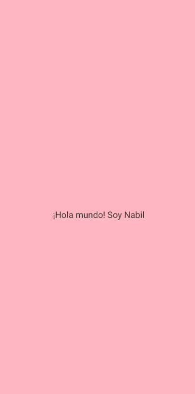
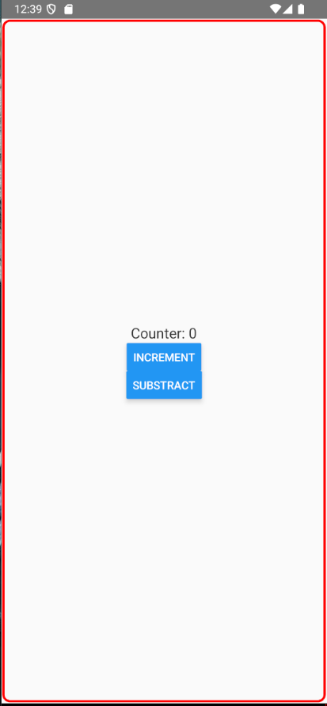
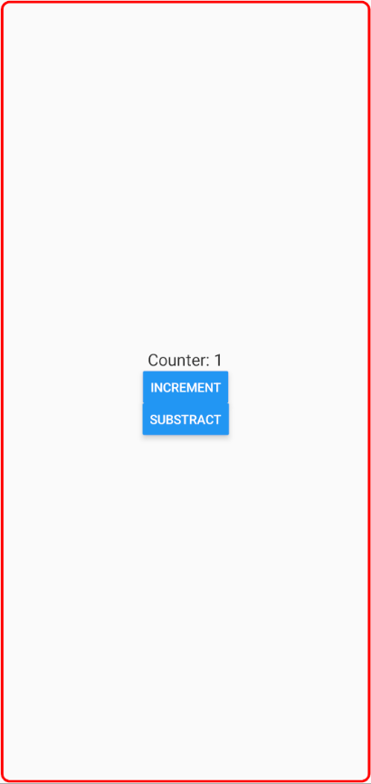
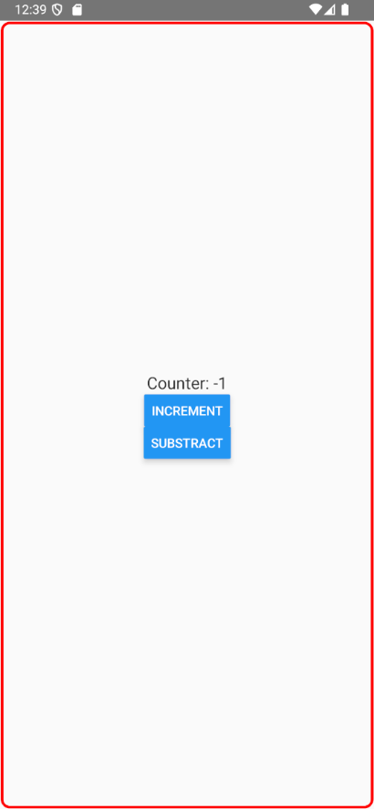
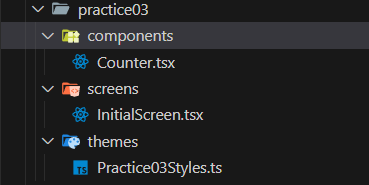
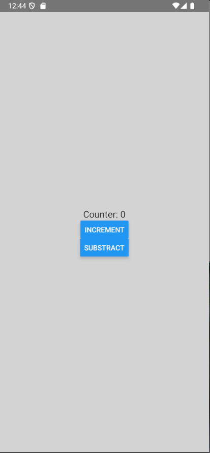

<div align="justify">

## Dossier - React Native

- [Práctica 01](#práctica-01)
- [Práctica 02](#práctica-02)
- [Práctica 03](#práctica-03)
- [Práctica 04](#práctica-04)
- [Práctica 05](#práctica-05)
- [Práctica 06](#práctica-06)
- [Práctica 07](#práctica-07)
- [Práctica 08](#práctica-08)
- [Práctica 09](#práctica-09)
- [Práctica 10](#práctica-10)
- [Práctica 11](#práctica-11)
- [Práctica 12](#práctica-12)
- [Práctica 13](#práctica-13)
- [Práctica 14](#práctica-14)
- [Práctica 15](#práctica-15)
- [Práctica 16](#práctica-16)
- [Práctica 17](#práctica-17)
- [Práctica 18](#práctica-18)
- [Práctica 19](#práctica-19)
- [Práctica 20](#práctica-20)
- [Práctica 21](#práctica-21)
- [Práctica 22](#práctica-22)
- [Práctica 23](#práctica-23)
- [Práctica 24](#práctica-24)
- [Práctica 25](#práctica-25)
- [Práctica 26](#práctica-26)
- [Práctica 27](#práctica-27)
- [Práctica 28](#práctica-28)
- [Práctica 29](#práctica-29)
- [Práctica 30](#práctica-30)
- [Práctica 31](#práctica-31)
- [Práctica 32](#práctica-32)
- [Práctica 33](#práctica-33)
- [Práctica 34](#práctica-34)
- [Práctica 35](#práctica-35)
- [Práctica 36](#práctica-36)
- [Práctica 37](#práctica-37)
- [Práctica 38](#práctica-38)
- [Práctica 39](#práctica-39)
- [Práctica 40](#práctica-40)

***

### Práctica 01

> 📂
> Crearemos un: “hola mundo!. Soy nombrealumno”
Para ello vamos a App.tsx. Dejaremos únicamente un componente View ( que es el
contenedor habitual en react native ) y pondremos dentro un componente Text ( que es
donde escribiremos ) Practica con tus conocimientos de CSS
Tener en cuenta que la mayoría son válidos, únicamente cambiando la separación con
guiones por camel case, y pasando un objeto JSON a style. Así por ejemplo, si queremos
hacer que el view ocupe todo en color rosa y ubique su contenido en el centro de la
pantalla:<View style={{ backgroundColor: "lightpink", flex: 1, justifyContent: 'center' }}>
>

- Código:

```tsx
const Practice01 = (props: Props) => {
  return (
    <View style={styles.container}>
      <Text style={styles.text}>¡Hola mundo! Soy Nabil</Text>
    </View>
  )
}
```

- Estilos:

```tsx
const styles = StyleSheet.create({
    container: {
        flex: 1,
        justifyContent: 'center',
        alignItems: 'center',
        backgroundColor: 'lightpink',
    },
    text: {
        fontSize: 18,
        color: '#333',
    },
});
```

- Captura:
<div align="center">

</div>

***
</br>

### Práctica 02

> 📂
> Reproducir el código anterior. Cambia el color del borde, redondea un poco el
borde ( busca la propiedad, es muy parecida a CSS ) y pon otro color de fondo. Modifica
también para que aparezcan dos botones. Uno será para incrementar ( el botón dirá: “incrementar” ) y otro botón para decrementar.
>


- Código:

```tsx
const Practice02 = (props: Props) => {
  const  [counter, setCounter] = useState(0);
  return (
    <View style={styles.container}>
      <Text style={styles.text}>Counter: {counter}</Text>
      <Button title='Increment' onPress={()=>setCounter(counter+1)}/>
      <Button title='Substract' onPress={()=>setCounter(counter-1)}/>
    </View>
  )
}

export default Practice02
```

- Estilos:

```tsx
const styles = StyleSheet.create({
    container: {
        flex: 1,
        borderWidth: 3,
        borderColor: "red",
        borderRadius: 10,
        backgroundColor: 'lightred',
        margin: 1,
        justifyContent: 'center',
        alignItems: 'center'
    },

    text: {
        fontSize: 18,
        color: '#333',
    },
});
```


- Captura:
<div align="center">



</div>

***
</br>


### Práctica 03

> 📂
> Crear la estructura de carpetas que hemos nombrado y un componente:
InicioScreen que será el que contenga la pantalla con los botones y el contador. En
App.tsx se hará la llamada a: <InicioScreen /> Los estilos deberán separarse usando
StyleSheet.create()
>


- Código:

```tsx
import Counter from '../components/Counter'
import styles from '../themes/Practice03Styles'

type Props = {}

const InitialScreen = (props: Props) => {
  return (
    <View style={styles.initialScreen}>
        <Counter/>
    </View>
  )
}
```

- Estilos:

```tsx
const styles = StyleSheet.create({
    container: {
        flex: 1,
        borderRadius: 10,
        backgroundColor: 'lightred',
        margin: 1,
        justifyContent: 'center',
        alignItems: 'center'
    },

    text: {
        fontSize: 18,
        color: '#333',
    },

    initialScreen: {
        flex: 1,
        backgroundColor: 'lightgrey',
        justifyContent: 'center',
        alignItems: 'center'
    }
});
```


- Captura:
<div align="center">


</div>

***
</br>

### Práctica 04

> 📂
> Realizar la pantalla anterior siguiendo lo descrito ( poner un width y un height
de 100 en el style del componente Caja.tsx ) . Para que el View “escenario” ocupe el total,
poner en sus estilos la propiedad: flex: 1


- Código:

```tsx
type Props = {
  color : string;
}

const Box = (props: Props) => {
  const { color } = props;

  return (
    <View style={{...styles.box, backgroundColor:color}}>
    </View>
  )
}

const BoxContainer = () => {
  const colors = ["red", "lightblue", "lightgreen"];

    return (
    <View style={styles.container}>
        {
            colors.map((colorItem, index) => (
            <Box key={index} color={colorItem}/>

            ))
        }  
    </View>
    )
}


const Practice04Screen = (props: Props) => {
  return (
    <View style={styles.mainContainer}>
      <Text style={styles.textTitle}>Contenedor principal </Text>
      <BoxContainer/>
    </View>
  )
}
```

***
</br>


### Práctica 05

> 📂
> Si en el componente: Caja.tsx ponemos 2 botones, uno
para incrementar el valor de flex y otro para decrementarlo, podremos ir
viendo el efecto de modificar dicho atributo en cada una de las tres
cajas. Agregar los dos botones y que el dato que se muestra: flex: 0 se
actualice según las pulsaciones de esos botones, implicando cambios en
el atributo flex correspondiente


- Código:

```tsx
const Box = (props: Props) => {
  const { color } = props;

  const [flex, setFlex] = useState(0);
  function changeFlexStyle(flexLevel : number) {
    if (flexLevel < 0){
      return;
    }
    setFlex(flexLevel);
  }

  return (
    <View style={{...styles.box, backgroundColor:color, flex:flex}}>
      <Button color={"red"} title='Flex +1' onPress={() => changeFlexStyle(flex+1)}></Button>
      <Button title='Flex -1' onPress={() => changeFlexStyle(flex-1)}></Button>
      <Text>Flex: {flex}</Text>
    </View>
  )
}

const BoxContainer05 = () => {
    const colors = ["red", "lightblue", "lightgreen"];

    return (
    <View style={styles.container}>
        {
            colors.map((colorItem, index) => (
                <Box05 key={index} color={colorItem}/>
            ))
        }  
    </View>
    )
}
```

***
</br>


### Práctica 06

> 📂
> Sustituir los botones por un objeto TouchableHighlight para
el botón: flex+1 que cuando se puse abra una alerta e incremente la
propiedad flex, y un objeto TouchableOpacity para el botón: flex-1 que
decremente la propiedad flex. Personalizar los estilos de esos dos objeto


- Código:

```tsx
const Box06 = (props: Props) => {
  const { color } = props;

  const [flex, setFlex] = useState(0);
  function changeFlexStyle(flexLevel : number) {
    if (flexLevel < 0){
      return;
    }

    setFlex(flexLevel);
    Alert.alert('changed flex to: ' + flexLevel);
  }

  return (
    <View style={{...styles.box, backgroundColor:color, flex:flex}}>
      <TouchableHighlight onPress={() => changeFlexStyle(flex+1)}>
        <View style={styles.button}>
          <Text> Flex +1 </Text>
        </View>
      </TouchableHighlight>
      <TouchableOpacity onPress={() => changeFlexStyle(flex-1)}>
        <View style={styles.button}>
          <Text> Flex -1</Text>
        </View>
      </TouchableOpacity>
      <Text>Flex: {flex}</Text>
    </View>
  )
}
```


***
</br>


### Práctica 07

> 📂
> Obtener el renderizado anterior, consiguiendo enviar mediante props, tanto el
nombre de la Caja.tsx como estilos personalizados que sobreescriban/agreguen a los que
estén por defecto (observar que Caja B tiene bordes redondeados )


- Código:

```tsx
type Props = {
  nameBox : string;
  stylesBox : any;
}

const Box07 = (props: Props) => {
  const { nameBox, stylesBox: styleBox } = props;

  const [flex, setFlex] = useState(0);
  function changeFlexStyle(flexLevel : number) {
    if (flexLevel < 0){
      return;
    }

    setFlex(flexLevel);
    Alert.alert('changed flex to: ' + flexLevel);
  }

  return (
    <View style={{...styles.box, ...styleBox, flex:flex}}>
      <TouchableHighlight onPress={() => changeFlexStyle(flex+1)}>
        <View style={styles.button}>
          <Text> Flex +1 </Text>
        </View>
      </TouchableHighlight>
      <TouchableOpacity onPress={() => changeFlexStyle(flex-1)}>
        <View style={styles.button}>
          <Text> Flex -1</Text>
        </View>
      </TouchableOpacity>
      <Text>{nameBox}</Text>
      <Text>Flex: {flex}</Text>
    </View>
  )
}

type BoxData= {
    nameBox: string;
    stylesBox: any;
}
const BoxContainer07 = () => {
    const names = ["Box A", "Box B", "Box C"];
    const colors = ["red", "lightblue", "lightgreen"];

    const arrData : BoxData[] = [
        {
            nameBox: names[0],
            stylesBox: { 
                flex: 0,
                backgroundColor: colors[0],
                padding: 10,
                margin: 5,
                justifyContent: 'center',
                alignItems: 'center'
            }
        }, 
        {
            nameBox: names[1],
            stylesBox: { flex: 0,
                backgroundColor: colors[1],
                padding: 10,
                margin: 5,
                justifyContent: 'center',
                alignItems: 'center'
            }
        },
        {
            nameBox: names[2],
            stylesBox: { flex: 0,
                backgroundColor: colors[2],
                padding: 10,
                margin: 5,
                justifyContent: 'center',
                alignItems: 'center'
            }
        },
    ]
    

    return (
    <View style={styles.container}>
        {
        
            arrData.map((box, index) =>(
                <Box05 key={index} stylesBox={box.stylesBox} nameBox={box.nameBox} />

            ))

        }  
    </View>
    )
}
```


- Captura:
<div align="center">

</div>

***
</br>

### Práctica 08

> 📂
> Obtener el renderizado anterior, empezando por no tener ningún círculo. A
medida que se pulsa el botón: Agregar Círculo, irán apareciendo. Observar que los colores
van variando progresivamente. Se empieza con un: rgb(red,green,blue) y según el número
de id que corresponda va variando un poco más ( tener en cuenta que los colores van de 0
a 255 no se puede superar ) Los dos botones cambian entre: wrap /nowrap y entre:
column/row. El renderizado que se muestra tiene: flexDirection: ‘row’, flexWrap: 'wrap'.
Observar que dos de los botones tienen estilos, así que no usaremos Button con ellos. Se
propone TouchableOpacityObtener el renderizado anterior, consiguiendo enviar mediante props, tanto el
nombre de la Caja.tsx como estilos personalizados que sobreescriban/agreguen a los que
estén por defecto (observar que Caja B tiene bordes redondeados )


- Código:

```tsx
type Props = {
  nameBox : string;
  red : number;
  green : number;
  blue : number;
}

const Box08 = (props: Props) => {
  const { nameBox, red, green, blue} = props;


  return (
    <View
      style={[styles.circle,
        {
          backgroundColor:`rgb(${red}, ${green}, ${blue})`,
        },
      ]}
    >
      <Text style={styles.circleText}>{nameBox}</Text>
    </View>

  )
}


/**
 * Type definition for the data structure representing a circle
 */
type DataCircle = {
  name: string;
  red : number;
  green : number;
  blue : number;
}

/**
 *  Type definition for the flex directions values 
 */

type DirectionType = "row" | "row-reverse" | "column" | "column-reverse";

/**
 *  Type definition for the wrap values 
 */
type WrapType= "wrap" | "no-wrap" | "wrap-reverse";

const Practice08Screen = (props: Props) => {

  /**
   * UseStates
   */
  const [direction, setDirection] = useState<DirectionType>("row");
  const [wrap, setWrap] = useState<WrapType>("wrap");
  const [circleArr, setCircleArr] = useState<DataCircle[]>([]);


  /**
   * Function to add a circle to the array of circles
   */
  function addCircle(){
    const lastCircle = circleArr[circleArr.length - 1] || {
      red: 50,
      green: 70,
      blue: 100,
    };

    setCircleArr([...circleArr, 
      {
        name: 'B'+(circleArr.length+1),
        red: (lastCircle.red + 25) % 256,
        green: (lastCircle.green + 35) % 256,
        blue: (lastCircle.blue + 55) % 256,
      }
    ]);
  }

  /**
   * Function to change the wrap property of the container
   */
  const changeWrap = () => {
    const options: WrapType[] = ["wrap", "no-wrap", "wrap-reverse"];
    const nextOptionPos = (options.indexOf(wrap!) + 1) % options.length;
    setWrap(options[nextOptionPos]);
  };

  
  /**
   * Function to change the flex direction property of the container
   */
  const changeRow = () => {
    const options: DirectionType[] = ["row", "column", "row-reverse", "column-reverse"];
    const nextOptionPos = (options.indexOf(direction!) + 1) % options.length;
    setDirection(options[nextOptionPos]);
  };

  return (
    <View style={styles.mainContainer}>
      

      <Button title='Add circle' onPress={addCircle}/>
      <TouchableOpacity onPress={()=> changeWrap()}> 
        <Text style={styles.btnwrap}>Change Wrap (Click here)</Text>
      </TouchableOpacity>
      <TouchableOpacity onPress={()=> changeRow()}> 
        <Text style={styles.btnrow}>Change Row (Click here)</Text>
      </TouchableOpacity>
 
      <View
        style={{...styles.container,
                  flexDirection: direction ?? "row",
                  flexWrap: wrap === "no-wrap" ? "nowrap" : wrap ?? "wrap",
        }}
      >
        {circleArr.map((circle, index) => (
            <Box08 key={index} nameBox={circle.name} red={circle.red} green={circle.green} blue={circle.blue}/>
        ))}
        
      </View>

    </View>
  )
}

```

***
</br>

### Práctica 09

> 📂
> Obtener renderizado parecido al anterior. Las imágenes pueden ser otras.
Debe funcionar el onChangeText para cambiar justifyContext y los botones para
alignContext. Una de las imágenes se guardará en una carpeta: img y se cargará con:
require().
Cuidado! NO poner wrap. Debemos establecer nowrap, o al hacer aignItems se ubicará
según el tamaño del objeto más grande de la columna, en lugar de respecto a su
contenedor


- Código:

```tsx
/**
 *  Type definition for the flex directions values (justifycontent)
 */

type PrimaryAlignment = "space-around" | "space-between" | "space-evenly" |  "center" | "flex-start" | "flex-end";

/**
 *  Type definition for the secondary alignment values  (alignitems)
 */
type SecondaryAlignment = "stretch" | "center" | "flex-start" | "flex-end";

const Practice09Screen = (props: Props) => {

  /**
   * UseStates
   */
  const [primaryAlignment, setPrimaryAlignment] = useState<PrimaryAlignment>('space-around');
  const [secondaryAlignment, setSecondaryAlignment] = useState<SecondaryAlignment>('flex-end');

  function modifyPrimaryAlignment(primaryAlignment: string){
    switch(primaryAlignment.toLocaleLowerCase()){
      case "center":
        setPrimaryAlignment('center');
        return;
      case "flex-start":
        setPrimaryAlignment('flex-start');
        return;
      case "flex-end":
        setPrimaryAlignment('flex-end');
        return;
      case "space-around":
        setPrimaryAlignment('space-between');
      return;
      case "space-between":
        setPrimaryAlignment('space-around');
        return;
      case "space-evenly":
        setPrimaryAlignment('space-evenly');
        return;
    }
  }

  function modifySecondaryAlignment(secondaryAlignment: string){
    switch(secondaryAlignment){
      case "stretch":
        setSecondaryAlignment('stretch');
        return;
      case "center":
        setSecondaryAlignment('center');
        return;
      case "flex-start":
        setSecondaryAlignment('flex-start');
        return;
      case "flex-end":
        setSecondaryAlignment('flex-end');
        return;
    }
  }
  return (
    <View style={styles.mainContainer}>
        <TextInput style={styles.input} placeholder='Primary alignment' onChangeText={modifyPrimaryAlignment} />
      <View>
        <ButtonContainer modifySecondaryAlignment={modifySecondaryAlignment}/>
      </View>
      <View style={{...styles.container,
                      justifyContent: primaryAlignment,
                      alignItems: secondaryAlignment,
                    }}>
            <Image source={require('../assets/img1.png')} style={styles.img}/>
            <Image source={require('../assets/img2.png')} style={styles.img}/>
            <Image source={require('../assets/img3.png')} style={styles.img}/>
      </View>

    </View>
  )
}

const ImgContainer = () => {
    return (
        <View style={{display:'flex', flexWrap:'nowrap', gap:10}}>
            <Image source={require('../assets/img2.png')} style={styles.img}/>
            <Image source={require('../assets/img2.png')} style={styles.img}/>
            <Image source={require('../assets/img3.png')} style={styles.img}/>
        </View>
    )
}

type Props = {
    modifySecondaryAlignment : Function;
}


const ButtonContainer = (props: Props) => {
    const { modifySecondaryAlignment } = props;

    return (
        <View style={{display:"flex", flexDirection:'row', alignItems:"flex-start", flexWrap:"wrap", gap:'15'}}>
            <Button title='STRETCH' onPress={()=> modifySecondaryAlignment("strecth")}/>
            <Button title='CENTER' onPress={()=> modifySecondaryAlignment("center")}/>
            <Button title='FLEX-START' onPress={()=> modifySecondaryAlignment("flex-start")}/>
            <Button title='FLEX-END' onPress={()=> modifySecondaryAlignment("flex-end")}/>
        </View>
    )
}
```

***
</br>

### Práctica 09.1

> 📂
> Hacer la calculadora descritaTomar varias imágenes y que se muestre al pulsar un botón una u otra de ellas de forma aleatoria. Haciendo uso de una estructura similar al AlmacenImg[] que acabamos de mostrar como ejemplo


- Código:

```tsx

const Practice091Screen = (props: Props) => {

  /**
   * UseStates
   */
  const [rndIndex, setRndIndex] = useState(0)

  const storedImages: storeImg[] = [
    {name: 'img1', location: require('../assets/img1.png')},
    {name: 'img2', location: require('../assets/img2.png')},
    {name: 'img3', location: require('../assets/img3.png')},
    {name: 'img4', location: require('../assets/img4.png')},

  ]


  function getRequire(index: number){
    const obtained = storedImages[index];

      if(obtained){
        return obtained.location;
      } else {
        return "";
      }  
  }


  return (
    <View style={styles.mainContainer}>
      <Button title='Change to rnd Image' onPress={() => 
                setRndIndex(Math.trunc(Math.random() * storedImages.length))}/>
      <Image source={
            getRequire(rndIndex)
            }
            style={{ minWidth: 50, height: 50, width: 'auto'}}
            alt='not found'/>
    </View>
  )
}
```

***
</br>


### Práctica 10

> 📂
> Hacer la calculadora descrita


### Práctica 11

> 📂
> Hacer un hook personalizado para la calculadora que tenga todo el código que
está fuera del return del component


- Código:

```tsx
type Props = {
    btnValue: string;
    bgColor: string;
    textColor: string;
    width: number;
    modifyParent: (selected: string) => void;
}


const Button10 = (props: Props) => {
    const { btnValue: value, bgColor, textColor, width, modifyParent } = props;


    function handlePress(btnValue: string) {
        modifyParent(btnValue);
    }

    return (
        <View>
            <TouchableOpacity onPress={() => handlePress(value)}>
                <Text style={{
                    ...styles.btn, backgroundColor: bgColor, color: textColor,
                    width: width
                }}>
                    {value}
                </Text>
            </TouchableOpacity>
        </View>
    )
}


const Practice10Screen = (props: Props) => {
  const {result, history, auxHistory, modify} = UseCalc();
  
  return (
    <SafeAreaView style={{flex:1, backgroundColor:'black'}}>
      <View style={{flex:1, flexDirection:'column-reverse'}}>
        <View style={{flex:1, flexDirection:'column-reverse', padding:10}}>

            <Text style={styles.text} adjustsFontSizeToFit={true} numberOfLines={1}> 
                {result} 
            </Text>
            <Text style={styles.historyText} adjustsFontSizeToFit={true} numberOfLines={1}> 
                  {auxHistory} 
            </Text>
        </View>
      </View>
      <View style={{flex:1}}>
        <View style={{flex:1, flexDirection:'row', columnGap:'1', margin:10}}>
          <Button10 btnValue={'AC'} bgColor='lightgrey' textColor='black' width={60} modifyParent={modify}/>
          <Button10 btnValue={'+/-'} bgColor='lightgrey' textColor='black' width={60} modifyParent={modify}/>
          <Button10 btnValue={'DL'} bgColor='lightgrey' textColor='black' width={60} modifyParent={modify}/>
          <Button10 btnValue={'/'} bgColor='orange' textColor='white' width={60} modifyParent={modify}/>
        </View>
        <View style={{flex:1, flexDirection:'row', columnGap:'1',  margin:10}}>
          <Button10 btnValue={'7'} bgColor='grey' textColor='white' width={60} modifyParent={modify}/>
          <Button10 btnValue={'8'} bgColor='grey' textColor='white' width={60} modifyParent={modify}/>
          <Button10 btnValue={'9'} bgColor='grey' textColor='white' width={60} modifyParent={modify}/>
          <Button10 btnValue={'x'} bgColor='orange' textColor='white' width={60} modifyParent={modify}/>
        </View>
        <View style={{flex:1, flexDirection:'row', columnGap:'1',  margin:10}}>
          <Button10 btnValue={'4'} bgColor='grey' textColor='white' width={60} modifyParent={modify}/>
          <Button10 btnValue={'5'} bgColor='grey' textColor='white' width={60} modifyParent={modify}/>
          <Button10 btnValue={'6'} bgColor='grey' textColor='white' width={60} modifyParent={modify}/>
          <Button10 btnValue={'-'} bgColor='orange' textColor='white' width={60} modifyParent={modify}/>
        </View>
        <View style={{flex:1, flexDirection:'row', columnGap:'1',  margin:10}}>
          <Button10 btnValue={'1'} bgColor='grey' textColor='white' width={60} modifyParent={modify}/>
          <Button10 btnValue={'2'} bgColor='grey' textColor='white' width={60} modifyParent={modify}/>
          <Button10 btnValue={'3'} bgColor='grey' textColor='white' width={60} modifyParent={modify}/>
          <Button10 btnValue={'+'} bgColor='orange' textColor='white' width={60} modifyParent={modify}/>
        </View>
        <View style={{flex:1, flexDirection:'row', columnGap:'1',  margin:10}}>
          <Button10 btnValue={'0'} bgColor='grey' textColor='white' width={150} modifyParent={modify}/>
          <Button10 btnValue={'.'} bgColor='grey' textColor='white' width={60} modifyParent={modify}/>
          <Button10 btnValue={'='} bgColor='orange' textColor='white' width={60} modifyParent={modify}/>
        </View>
      </View>
    </SafeAreaView>
  )
}

const UseCalc = () => {

    /**
     * UseStates
     */
    const [result, setResult] = useState<string>("0");
    const [history, setHistory] = useState<string>("")
    const [auxHistory, setAuxHistory] = useState<string>("");
    const [operatorChosen, setOperator] = useState<string>("");

    /**
     * Other properties
     */
    const [firstInput, setFirstInput] = useState<boolean>(true)

    function changePosNeg(num: number) {
        return (num * -1);
    }

    function modify(selected: string) {
        if (!isNaN(parseFloat(selected))) {
            if (firstInput) {
                setResult("");
                setFirstInput(false);
            }

            const aux = parseFloat(result + selected);
            setResult("" + aux);

        } else if (selected === "." && !result.includes(".")) {
            const aux = result + selected;
            setResult(aux);
        } else {
            selectOperator(selected);
        }

    }

    function selectOperator(operator: string) {
        switch (operator) {
            case 'AC':
                setHistory('');
                setAuxHistory('');
                setResult('0');
                return;
            case '+/-':
                setResult(changePosNeg(parseFloat(result)).toString());
                return;
            case 'DL':
                handleDelete();
                return;
            case '/':
                if (operatorChosedBefore()) {
                    return;
                }
                setHistory(result);
                setAuxHistory(result);
                setResult('0');
                setOperator(operator);
                return;
            case 'x':
                if (operatorChosedBefore()) {
                    return;
                }

                setHistory(result);
                setAuxHistory(result);
                setResult('0');
                setOperator("x");
                return;
            case '+':
                if (operatorChosedBefore()) {
                    return;
                }

                setHistory(result);
                setAuxHistory(result);
                setResult('0');
                setOperator("+");
                return;
            case '-':
                if (operatorChosedBefore()) {
                    return;
                }

                setHistory(result);
                setAuxHistory(result);
                setResult('0');
                setOperator("-");
                return;

            case '=':
                if (operatorChosen === '') {
                    return;
                }

                const operationResult = calculateResult(operatorChosen);
                
                if (operationResult !== 0){
                    setHistory(operationResult.toString());
                    setAuxHistory(history + " " + operatorChosen+ " " + result + " = " + operationResult.toString());
                    setResult(operationResult.toString());
                } else {
                    setHistory("");
                }

                setOperator("");
                return;
        }

        function operatorChosedBefore() {
            if (operatorChosen !== '') {
                const operationResult = calculateResult(operatorChosen);

                if (operationResult !== 0 || isNaN(operationResult)){
                    setHistory(operationResult.toString());
                    setAuxHistory(history + " " + operatorChosen+ " " + result + " = " + operationResult.toString());
                    setResult(operationResult.toString());
                    setOperator('');
                } 

                return true;
            }

            return false;
        }


        function calculateResult(operator: string): number {
            let auxResult: number = 0;
            let auxFinal = 0;
            switch (operator) {
                case "+":
                    auxResult = parseFloat(history) + parseFloat(result);
                    auxFinal = auxResult;
                    break;
                case "-":
                    auxResult = parseFloat(history) - parseFloat(result);
                    auxFinal = auxResult;
                    break;
                case "x":
                    auxResult = parseFloat(history) * parseFloat(result);
                    auxFinal = auxResult;
                    break;
                case "/":
                    if (parseFloat(result) === 0){
                        Alert.alert("Invalid operation");
                        auxFinal = parseFloat(result);
                    } else {
                        auxResult = (parseFloat(history)) / (parseFloat(result));
                        auxFinal = auxResult;
                    }

                    break;
            }

            return auxFinal;
        }


        function handleDelete() {
            if (result === '0' || result === '') {
                return;
            }

            const aux = result.toString().slice(0, -1);
            if (result.includes('-') && result.length == 2) {
                setResult('0');
                return;
            }

            setResult(aux);
        }

    }
    return {
        result,
        history,
        auxHistory,
        modify
    }

}
```

</br>

### Práctica 12

> 📂
> Hacer un hook personalizado para la calculadora que tenga todo el código que
está fuera del return del componentReproducir el ejemplo anterior, generando una pantalla específica, pero le
haremos algunas diferencias. El botón dirá: “cambiar de color” entonces se genera un
color aleatorio a mostrar ( puede ser de un array previamente generado de colores:
“gray”, “blue”,... ) y se le muestra una alerta al usuario diciendo cuál es el color que se va
a poner de background de la pantalla. Si pulsa ok se cambia el fondo, si pulsa cancel se mantiene el previo


- Código:

```tsx
const Practice12Screen = (props: Props) => {

    const [currentBgColor, setCurrentBgColor] = useState<string>('red')
    const colors = ['red', 'green', 'yellow', 'blue'];

    function showAlert() {
        Alert.alert(
            'Color change', 'Change background color to other',
            [
                {
                    text: `Current color: ${currentBgColor}`,
                    onPress: () => console.log('keep current color'),
                },
                {
                    text: 'Change to other',
                    onPress: () => changeBackgroundColor(),
                }

            ]
        );
    }

    function changeBackgroundColor(): void {
        
        let aux = currentBgColor;
        
        while(aux === currentBgColor){
            let rndPos = Math.trunc(Math.random() * colors.length);
            aux = colors[rndPos];
        }


        setCurrentBgColor(aux);
    }

    return (
        <SafeAreaView style={{flex:1}}>
            <View style={{flex:1, backgroundColor:currentBgColor}}>
                <Button title='Change background color'onPress={showAlert}/>
            </View>
        </SafeAreaView>
    )
}

export default Practice12Screen
```

***
</br>

### Práctica 13

> 📂
> Usar el prompt descrito para recrear el ejercicio anterior del color de fondo.
Ahora en lugar de una alerta se mostrará un prompt para que el usuario introduzca un color
de fondo en lugar de uno aleatorio.
Nota: es posible que de error si se instala con la app ya lanzada. En ese caso parar metro y
volver a lanzar


- Código:

```tsx
const Practice13Screen = (props: Props) => {

    const [currentBgColor, setCurrentBgColor] = useState<string>('red')
    const colors = ['red', 'green', 'yellow', 'blue'];

    function showAlert() {
        prompt(
            'Change background color to other',
            'Select a color by name',
            [
                {text: 'Cancel'},
                {text: 'OK', onPress: () => changeBackgroundColor()},
            ]
        )

        
    
    }

    function changeBackgroundColor(): void {
        
        let aux = currentBgColor;
        
        while(aux === currentBgColor){
            let rndPos = Math.trunc(Math.random() * colors.length);
            aux = colors[rndPos];
        }


        setCurrentBgColor(aux);
    }

    return (
        <SafeAreaView style={{flex:1}}>
            <View style={{flex:1, backgroundColor:currentBgColor}}>
                <Button title='Change background color'onPress={showAlert}/>
            </View>
        </SafeAreaView>
    )
}
```


- Captura:
<div align="center">

</div>

***
</br>

### Práctica 14

> 📂
> Reproducir el ejemplo anterior, poniendo en el pulsador ( la bola ) los
colores si falso: brown, si verdadero: orange No aplicar los otros dos colores del
ejemplo El switch debe valer para poner un borde a toda la pantalla de color rojo o
quitarle el borde


- Código:

```tsx
const Practice14Screen = (props: Props) => {

    const [currentBgColor, setCurrentBgColor] = useState<string>('blue')
    const colors = ['red', 'green', 'yellow', 'blue'];

    const [active, setActive] = useState<boolean>(false);


    function changeBackgroundColor(): void {
        let aux = currentBgColor;
        
        while(aux === currentBgColor){
            let rndPos = Math.trunc(Math.random() * colors.length);
            aux = colors[rndPos];
        }
        setCurrentBgColor(aux);
    }

    return (
        <SafeAreaView style={{flex:1}}>
            <View style={
                    {   
                        flex:1, backgroundColor:'white', alignItems:'center', 
                        justifyContent:'center',
                    }
                }

            >
            <Switch
                trackColor={{false:'brown', true:'red'}}
                onValueChange={()=> setActive(!active)}
                value={active}
            />
            </View>
        </SafeAreaView>
    )
}
```

</br>


### Práctica 15

> 📂
> Reproducir el ejemplo anterior, completando lo que falta (poniendo el switch
de: casado )


- Código:

```tsx
type FormData = {
    jubilado: boolean,
    casado: boolean,
    edad: number,
    nombre:string
}

const Practice15Screen = (props: Props) => {
    const [formData, setFormData] = useState<FormData>({} as FormData);

    function fillFormData (value : boolean|number|string, field: keyof FormData){
        setFormData(
            {   
                ...formData, 
                [field]: value 
            }
        );
    } 
    
    return (
        <SafeAreaView style={{flex:1}}>
            <View style={{flex:1}}>
                <Text style={{color:'white'}}>Jubilado: {formData.jubilado? 'Si' : 'No'}
                    <Switch
                        onValueChange={()=> fillFormData(!formData.jubilado, 'jubilado')}
                        value={formData.jubilado}
                    />
                </Text>
                <Text style={{color:'white'}}>Casado: {formData.casado? 'Si' : 'No'}
                    <Switch
                        onValueChange={()=> fillFormData(!formData.casado, 'casado')}
                        value={formData.casado}
                    />
                </Text>
                <TextInput placeholder='nombre' onChangeText={(text)=>fillFormData(text, 'nombre')}/>
                <TextInput placeholder='edad' onChangeText={(text)=>fillFormData(text, 'edad')}/>
                <Text style={{color:'white'}}>{JSON.stringify(formData)}</Text>
            </View>
        </SafeAreaView>
    )   
}
```

***
</br>


### Práctica 16

> 📂
> Reproducir el ejemplo anterior, reemplazando el array de personas por uno
de productos donde se quiere ver el nombre del producto, el precio y el stock. No debe
haber separador. Dale un estilo personalizado a los items ( observa que en cada item
viene un atributo index ) y muestra un color de fondo para los items impares y otro
distinto para los pares. Pon centrado y más grande la cabecera y que diga: Lista
Productos. Nota: renderItem((p)=> p.item //objeto, p.index //posición en el array


- Código:

```tsx

type Product = {
    id: number,
    name: string,
    price: number,
    stock: number,
}
const Practice16Screen = (props: Props) => {

    const array: Product[] = [
        { id: 1, name: 'Producto 1', price: 100, stock: 50 },
        { id: 2, name: 'Producto 2', price: 200, stock: 30 },
        { id: 3, name: 'Producto 3', price: 300, stock: 20 },
        { id: 4, name: 'Producto 4', price: 400, stock: 10 },
        { id: 5, name: 'Producto 5', price: 500, stock: 0 },
        { id: 6, name: 'Producto 6', price: 600, stock: 40 },
        { id: 7, name: 'Producto 7', price: 700, stock: 15 },
        { id: 8, name: 'Producto 8', price: 800, stock: 35 },
    ];


    return (
        <SafeAreaView style={styles.bgColor}>
            <View style={{flex:1}}>
                <FlatList 
                data={array}
                renderItem={(p) => { 
                    return (
                        p.index % 2 === 0 ?
                        <View style={styles.items}>
                            <Text>{JSON.stringify(p)}</Text>
                        </View>
                        :
                        <View style={{...styles.items, backgroundColor: 'lightgray'}}>
                            <Text>{JSON.stringify(p)}</Text>
                        </View>
                    )
                }}
                keyExtractor={ (item, index) => item.name + index}
                ListHeaderComponent={() => <Text style={styles.text}>Lista de Productos</Text>}                
                />     
            </View>
        </SafeAreaView>

    )
}
```


- Captura:
<div align="center">

</div>

***
</br>


### Práctica 17

> 📂
> Basándose en el ejemplo de formulario que hemos hecho, vamos a realizar
ejercicio de cálculo de imc. Estará el componente: CardPersona.tsx que contendrá el
formulario para imc (id, nombre, altura, peso ) y el componente padre que mostrará la
lista de cards una debajo de otra. Habrá un botón con title: “+” para crear cada nuevo
CardPersona. Habrá en cada card un botón para poder borrar la persona de la lista
Nota: observar que en el padre únicamente se precisa el tamaño del array ( que se obtiene
al pulsar el botón y además genera el id que se pasa por props). Así que modificar el state
de la card no tiene por qué modificar el state de la lista de cards. Otra cosa es el botón
eliminar, que sí debe afectar al state del padre.


- Código:

```tsx
type Props = {
    person : Person;
    modifyPerson : (person: Person) => void;
}

type Person = {
    id: number,
    name: string,
    heigth: number,
    weight: number,
}

const PersonCard = (props: Props) => {
    const { person } = props;

    const [imc, setimc] = useState(0)
    const [formData, setFormData] = useState<Person>({} as Person);


    useEffect(() => {
        
    }, [person])

    function calculateIMC(){
        if(formData.weight && formData.heigth){
            setimc(formData.weight / ((formData.heigth)**2)*1000);
        }
    }

    function fillFormData (value : number|string, field: keyof Person){
        setFormData(
            {   
                ...formData, 
                [field]: value 
            }
        );
    } 

    return (
        <View style={styles.card}>
            <TextInput style={styles.input} placeholder='name' onChangeText={(text)=>fillFormData(text, 'name')}/>
            <TextInput style={styles.input} placeholder='weight' onChangeText={(text)=>fillFormData(parseFloat(text), 'weight')}/>
            <TextInput style={styles.input} placeholder='heigth' onChangeText={(text)=>fillFormData(parseFloat(text), 'heigth')}/>
            <Text style={styles.text}>IMC: {imc}</Text>
            <View>
                <TouchableOpacity onPress={calculateIMC} style={styles.btn}>
                    <Text>Calculate IMC</Text>
                </TouchableOpacity>
            </View>
        </View>
    )
}

type Person = {
    id: number,
    name: string,
    heigth: number,
    weight: number,
}

const Practice17Screen = (props: Props) => {
    const [personList, setPersonList] = useState<Person[]>([]);

    useEffect(() => {

    }, [personList]);
    
    function addPerson () : void {  
        setPersonList([...personList, {} as Person]);
    };

    
    function modifyPerson (person : Person) : void {
        let arrAux = personList;
        arrAux[person.id-1] = person;
        setPersonList([...arrAux]);
    }

    return (
        <SafeAreaView style={{flex:1, backgroundColor:'white'}}>
            <View style={{flex:1}}>
                <Text>IMC Calculator</Text>
                <TouchableOpacity onPress={() => addPerson()}>
                    <Text style={{textAlign:'center', borderRadius:50, borderColor:'black'}}>+</Text>
                </TouchableOpacity>
                    {personList.map((item, index) => (
                            <PersonCard key={index} 
                            modifyPerson={modifyPerson} person={item}/>
                        )
                    )}
            </View>        
        </SafeAreaView>
    )
}
```


- Captura:
<div align="center">

</div>

***
</br>

### Práctica 18

> 📂
> Crear una pantalla con un TextiInput un button y un view para hacer una
especie de diario.
Cuando el usuario escribe un texto y pulsa en el botón aparece en el view el texto
introducido con la fecha ( incluye segundos ) y un smile que describa las emociones
escritas en el texto. Así si el usuario ha incluido entre su texto: “:-)” entonces aparecerá
una imagen ( icono ) de sonrisa al lado del texto escrito del usuario. Si escribe: “:-(“ lo
mismo pero triste


- Código:

```tsx
const Practice18Screens = (props: Props) => {
    const [inputContent, setInputContent] = useState<String>("");
    const [history, setHistory] = useState<String[]>([]);
    const emojis : string[] = [':-(',':-)'];    

    function handlePress(){
        let aux = inputContent +  "-- " + Date.now();
        setInputContent(aux);
        setHistory([...history, inputContent ]);
        setInputContent("");
    }
    
    function checkContents(value : String) : number{
        if (value.includes(emojis[0])){
            return 1;
        } 

        if (value.includes(emojis[1])){
            return -1;
        }

        return 0;
    }

    return (
        <View>
            <TextInput placeholder='Insert any text' onChangeText={(e) => setInputContent(e)}/>
            <Button title="Submit" onPress={handlePress}/>

            {
                history.map((item, index) => (
                    <View>
                    { checkContents(item) === 1 &&
                        <View>
                            <Text key={index}>{item}</Text>
                            <Icon name="sad-outline" size={50}></Icon>
                        </View>
                    }
                    { checkContents(item) === -1 &&
                        <View>
                            <Text key={index}>{item}</Text>
                            <Icon name="happy-outline" size={50}></Icon>
                        </View>
                    }
                    { checkContents(item) === 0 &&
                        <Text key={index}>{item}</Text>
                    }

                    </View>
                    
                ))
            }
        </View>
    )
}
```


***
</br>


### Práctica 19

> 📂
> Conversor de iconos smiles a texto. Esta otra pantalla tiene en la parte
superior varios iconos ( uno para sonrisa, otro para tristeza, etc ) El usuario va
escribiendo en un TextInput un texto y quiere agregar en formato texto el smile. Para que
no tenga que conocerlo, basta que en ese momento pulse en el icono correspondiente y le
aparecerá agregado al final de su texto, el texto smile correspondiente

- Código:

```tsx

const Practice19Screen = (props: Props) => {
    const [inputContent, setInputContent] = useState<string>("");
    const emojis : string[] = [':-(',':-)'];    

    function handlePress(value: string){
        
        let aux = inputContent;
        switch (value) {
            case 'happy':
                aux += " " + emojis[1];
                setInputContent(aux);
                return;
        
            case 'sad':
                aux += " " + emojis[0];
                setInputContent(aux);
                return;   
            default:
                return;
        }
    }

    return (
        <View style={{flex:1}}>
            <View style={{alignItems:'center', flexDirection:'row', justifyContent:'center'}}>
                <TouchableOpacity onPress={() => handlePress('happy')} style={{width:50}}>
                    <Icon name="happy-outline" size={50}></Icon>
                </TouchableOpacity>
                <TouchableOpacity onPress={() => handlePress('sad')} style={{width:50}}>
                    <Icon name="sad-outline" size={50}></Icon>
                </TouchableOpacity>
            </View>
            <TextInput placeholder='Insert any text' value={inputContent} onChangeText={(e) => setInputContent(e)}
                style={{height: 40, borderColor: 'gray', borderWidth: 1, marginBottom: 10}} 
            />
        </View>
    )
}

```


***
</br>


### Práctica 20

> 📂
> Reproducir el anterior ejemplo de Stack.Navigator con HomeScreen.

- Código:

```tsx


type PrincipalStackParamList = {
    Home: undefined,
    Profile: undefined,
    Extra: {message: string, icon : string},
}

type PropsProfile = NativeStackScreenProps<PrincipalStackParamList, 'Extra'>;


const ExtraScreen = (props: PropsProfile) => {
    return (
        <View style={{flex:1, justifyContent:'center', alignItems:'center'}}>
            <Text>Extra Screen</Text>
            <Text>Message received: {props.route.params.message}</Text>
            <Icon name={`${props.route.params.icon}-outline`} size={50} color={'blue'} />
            <Button title="Go to Home" 
                onPress={() => props.navigation.navigate('Home')}/>
            <Button title="Go to Profile" 
                onPress={() => props.navigation.navigate('Profile')}/>
        </View>
    )
}

type PrincipalStackParamList = {
    Home: undefined,
    Profile: undefined,
    Extra: {message: string, icon : string},
}

type PropsHome = NativeStackScreenProps<PrincipalStackParamList, 'Home'>;

const HomeScreen = (props: PropsHome) => {

    return (
        <View style={{flex:1, justifyContent:'center', alignItems:'center'}}>
            <Text>Home Screen</Text>
            <Button title="Go to Profile" 
                onPress={() => props.navigation.navigate('Profile')}/>
            <Button title="Go to Extra" 
                onPress={() => props.navigation.navigate('Extra', {message: "Greetings from Home", icon : "home"})}/>
            <Icon name='car-outline' size={50} color={'blue'} />
        </View>
    )
}

type PrincipalStackParamList = {
    Home: undefined,
    Profile: undefined,
    Extra: {message: string, icon: string},
}

type PropsProfile = NativeStackScreenProps<PrincipalStackParamList, 'Profile'>;


const ProfileScreen = (props: PropsProfile) => {
    return (
        <View style={{flex:1, justifyContent:'center', alignItems:'center'}}>
            <Text>ProfileScreen</Text>
            <Button title="Go to Home" 
                onPress={() => props.navigation.navigate('Home')}/>
            <Button title="Go to Extra" 
                onPress={() => props.navigation.navigate('Extra', {message: "Greetings from Profile", icon: "person"})}/>
        </View>
    )
}
```


- Captura:
<div align="center">

</div>

***
</br>


### Práctica 21

> 📂
> Reproducir el anterior ejemplo con tres Screen en el navigator. Poner un
TextInput en PrimeraScreen para que el usuario introduzca un nombre. Cuando el
usuario pulse el botón que lo lleva a TeceraScreen, el texto introducido en el TextInput se envía como parámetro a TerceraScreen y allí dira: “Saludos nombreusuario. Bienvenido!” Como sabemos, intentamos dejar nuestro componente App.tsx bastante limpio. Crear un nuevo componente: src/navigation/StackNavigation.tsx y trasladar todo el código de la navegación. De tal forma que nuestro
App.tsx quede únicamente:

- Código:

```tsx
type PrincipalStackParamList = {
    FirstScreen: undefined,
    SecondScreen: undefined,
    ThirdScreen: {message : string, icon:string},
}

const Stack = createNativeStackNavigator<PrincipalStackParamList>();

const PrincipalStack = (props: Props) => {
    return (
        <Stack.Navigator
            screenOptions={{headerShown: false,contentStyle:{backgroundColor:'lightblue'}}}
        
        >
            <Stack.Screen name="FirstScreen" component={FirstScreen21} />
            <Stack.Screen name="SecondScreen" component={SecondScreen21} />
            <Stack.Screen name="ThirdScreen" component={ThirdScreen21} />
        </Stack.Navigator>
    )
}

type PropsHome = NativeStackScreenProps<PrincipalStackParamList, 'FirstScreen'>;

const FirstScreen21 = (props: PropsHome) => {
    const [name, setName] = useState('');

    return (
        <View style={{flex:1, justifyContent:'center', alignItems:'center'}}>
            <Text>First Screen</Text>
            <TextInput
                style={styles.input}
                placeholder="Enter your name"
                value={name}
                onChangeText={(text) => setName(text)}
            />
            <Button title="Go to second screen" 
                onPress={() => props.navigation.navigate('SecondScreen')}/>
            <Button title="Go to third screen" 
                onPress={() => props.navigation.navigate('ThirdScreen', {message: `Greetings ${name}!`, icon : "home"})}/>
            <Icon name='car-outline' size={50} color={'blue'} />
        </View>
    )
}

type PropsProfile = NativeStackScreenProps<PrincipalStackParamList, 'SecondScreen'>;


const SecondScreen21 = (props: PropsProfile) => {
    const [name, setName] = useState('');
    
    return (
        <View style={{flex:1, justifyContent:'center', alignItems:'center'}}>
            <Text>Second Screen</Text>
            <TextInput
                style={styles.input}
                placeholder="Enter your name"
                value={name}
                onChangeText={(text) => setName(text)}
            />
            <Button title="Go to first screen" 
                onPress={() => props.navigation.navigate('FirstScreen')}/>
            <Button title="Go to third screen" 
                onPress={() => props.navigation.navigate('ThirdScreen', {message: `Greetings ${name}!`, icon : "home"})}/>
        </View>
    )
}

type PropsProfile = NativeStackScreenProps<PrincipalStackParamList, 'ThirdScreen'>;

const ThirdScreen21 = (props: PropsProfile) => {
    return (
        <View style={{flex:1, justifyContent:'center', alignItems:'center'}}>
            <Text>Third Screen</Text>
            <Text>Message received: {props.route.params.message}</Text>
            <Icon name={`${props.route.params.icon}-outline`} size={50} color={'blue'} />
            <Button title="Go to first screen" 
                onPress={() => props.navigation.navigate('FirstScreen')}/>
            <Button title="Go to second screen" 
                onPress={() => props.navigation.navigate('SecondScreen')}/>
        </View>
    )
}

```


- Captura:
<div align="center">

</div>

***
</br>

### Práctica 22

> 📂
> Reproducir el anterior ejemplo con dos Screen en el navigator. Cambiar el
color de fondo del header ( a uno de tu elección). Poner en blanco el color del título. Que
no se muestre el headerBack ( establecerlo a false.Nota: según el emulador se podrá aún
regresar arrastrando desde el extremo de la derecha hacia la izquierda. En otros
emuladores quizás no se pueda regresar). Alinear el título en el centro y pon tu nombre en
el título

- Código:

```tsx

type PrincipalStackParamList = {
    FirstScreen: undefined,
    SecondScreen: undefined,
}

const Stack = createNativeStackNavigator<PrincipalStackParamList>();

const PrincipalStack22 = (props: Props) => {
    return (
    <Stack.Navigator
        screenOptions={{
            headerStyle: {
                backgroundColor: '#008080',
            },
            headerTintColor: 'white', 
            headerTitleAlign: 'center',
            headerBackVisible: false,
        }}
        >
        <Stack.Screen name="FirstScreen" component={FirstScreen22} options={{ title: 'Nabil' }} />
        <Stack.Screen name="SecondScreen" component={SecondScreen22} options={{ title: 'Nabil' }} />
    </Stack.Navigator>
    )
}

type PropsHome = NativeStackScreenProps<PrincipalStackParamList, 'FirstScreen'>;

const FirstScreen22 = (props: PropsHome) => {

    return (
        <View style={{flex:1, justifyContent:'center', alignItems:'center'}}>
            <Text>First Screen</Text>
            <Button title="Go to second screen" 
                onPress={() => props.navigation.navigate('SecondScreen')}/>
        </View>
    )
}

type PropsProfile = NativeStackScreenProps<PrincipalStackParamList, 'SecondScreen'>;


const SecondScreen22 = (props: PropsProfile) => {
    
    return (
        <View style={{flex:1, justifyContent:'center', alignItems:'center'}}>
            <Text>Second Screen</Text>
            <Button title="Go to first screen" 
                onPress={() => props.navigation.navigate('FirstScreen')}/>

        </View>
    )
}
```


- Captura:
<div align="center">

</div>

***
</br>

### Práctica 23

> 📂
> Vamos a hacer el clásico: todo list
Aparecerán 2 pantallas, una
con la lista de tareas. En cada
fila del flatlist se puede pulsar
sobre el check y que quede
marcada como realizada o no
( observar que si está finalizada
el texto queda tachado y
cambia el icono ) al hacer click
sobre el icono de editar nos
lleva a la segunda pantalla y
modificamos el asunto y si está
o no realizada. Si se pulsa
sobre el icono de papelera
borra la tarea. El botón más:
“+” nos lleva a la segunda
pantalla para crear una nueva
tarea ( los ids se generan
automáticamente y el usuario
no los puede editar )
Buscar por: “options” en Statck.Screen allí podemos poner opciones muy similar a:
screenoptions de Stack.Navigator, pero adicionalmente puede tratar con parámetros de la
ruta y así mostrar el id de la tarea en el título
Se debe generar un contexto donde se guardará el state de la lista de ToDos y su
correspondiente setter.

- Código:

```tsx

```


- Captura:
<div align="center">

</div>

***
</br>


### Práctica 24

> 📂
> Crear una navegación Drawer. La primera Drawer.screen será:
StackNavigation.tsx (así se cargará por defecto el Stack ) y la otra: AboutScreen.tsx.
Poner en AboutScreen.tsx información tuya ( tú nombre, curso, etc ) En
StackNavigation.tsx tendremos un Stack Navigator que apunte al menos a dos pantallas,
una será una pantalla de enlaces a otras actividades del Stack, La segunda pantalla será la
tarea de la calculadora ( que deberá estar enlazada en la página de enlaces ) Así desde el
Drawer podemos acceer directamente a About y luego si desde el Drawer se elige el
Stack podemos acceder a las otras pantallas del Stack.
Pon en la carpeta navigation tanto MenuLateral.tsx como StackNavigation.tsx

- Código:

```tsx

```


- Captura:
<div align="center">

</div>

***
</br>


### Práctica 25

> 📂
> Reproducir el ejemplo anterior. Girar la pantalla ¿ quéda el menú visible ?
Cambiar el color de fondo del menú lateral y poner que tenga un ancho de 200. Prueba a
comentar y descomentar la línea del drawerContent ¿ Cuándo lo activas siguen
mostrándose los enlaces a las pantallas ?
Vamos a personalizar el menú.

- Código:

```tsx

```


- Captura:
<div align="center">

</div>

***
</br>


### Práctica 26

> 📂
> Realizar la app de mascotas descrita

- Código:

```tsx

```


- Captura:
<div align="center">

</div>

***
</br>


### Práctica 27

> 📂
> Crear una app con dos tabs. En una de ellas aparecerá un icono relacionado
con operaciones matemáticas y al acceder cargará un StackNavigation que en su primera
pantalla tendrá enlaces a tareas realizadas ( una de ellas será la calculadora
La otra tab tendrá el About.tsx que mostrará tu nombre, curso, aficione

- Código:

```tsx

```


- Captura:
<div align="center">

</div>

***
</br>


### Práctica 28

> 📂
> Aplicación Pokemon.
Haremos una aplicación para ver datos de pokemon. Habrá
dos tabs y en cada tab tendremos un StackNavigation. La
primera tab tiene un Stack que será para visualizar la lista de
pokemon ( usaremos un flatlist ) en la primera pantalla del Stack
y cuando se pulse sobre un pokemon se abrirá otra Screen del
Stack para ver todos los datos del pokemon ( con sus diferentes
sprites )
La segunda tab tiene otro Stack. En la primera de las pantallas
del Stack hay un cuadro de texto para buscar pokemon por
subnombre ( aparecerán los pokemon que en su nombre incluyan
el texto introducido ). Cuando pulsamos sobre alguno de la lista
obtenida nos lleva a la Screen con todos los datos del pokemon.

- Código:

```tsx

```


- Captura:
<div align="center">

</div>

***
</br>


### Práctica 29

> 📂
> Reproducir el ejemplo anterior. Pero en lugar de console.log aparecerá la
localización en un <Text> mediante json.stringify(). En el caso de que no se tenga
permisos se mostrará que no los hay. Probar a conceder o no el permiso, luego
eliminarlo, etc

- Código:

```tsx

```


- Captura:
<div align="center">

</div>

***
</br>

### Práctica 30

> 📂
> Vamos a crear un historial de ubicaciones, en la actividad de permisos de
geolocalización. Vamos a modificarla de tal forma que el botón lo que haga es guardar en
asyncstorage la latitud, longitud y timestamp ( se debe mantener que si no hay permisos
se soliciten ) Al pulsar en el botón se informará en un <Text> de que se ha guardado y la
posición que ha guardado. Habrá otro botón que se llamará “historial” que al pulsarlo lee
del asyncstorage la lista de posiciones guardadas y las muestra en un <Text>

- Código:

```tsx

```


- Captura:
<div align="center">

</div>

***
</br>

### Práctica 31

> 📂
> Hacer la actividad descrita. Cuando arranque la aplicación y se muestre la
primera pantalla poner modo avión cerrar la aplicación y volver abrir. Hacer click en
alguna de las noticias. Si todo está bien cargará la noticia del async storage y la mostrará

- Código:

```tsx

```


- Captura:
<div align="center">

</div>

***
</br>


### Práctica 32

> 📂
> a) Reproducir el ejemplo anterior ( usar únicamente la clase Persona no
hace falta la otra clase )
b) Poner dos textinput. Uno para la edad y otro para el nombre. Ahora al pulsar en el
botón, en lugar de datos aleatorios, se creará en la base de datos la persona introducida
por el usuario

- Código:

```tsx

```


- Captura:
<div align="center">

</div>

***
</br>


### Práctica 33

> 📂
> En la actividad del TodoList vamos a persistir en base de datos, y así una
vez cerremos la aplicación y la volvamos a abrir se mantendrá la información de las
tareas. Podemos utilizar el tipo boolean en TypeORM:
@Column('boolean') completada: boolean;
Para decir si se completó el todo. Observar que para evitar errores, cuando corresponda
el update y el delete de la tarea, mejor usar el id como condición

- Código:

```tsx

```


- Captura:
<div align="center">

</div>

***
</br>

### Práctica 34

> 📂
> Vamos a crear una actividad que emule una tienda de productos de comida.
Tendremos tabs y en una de las tabs introducimos los productos (nombre, precio, stock y
un boolean: descontinuado ) En la segunda tab hay un cuadro de texto para subnombre,
otro para precio menor que el número dado y otro para precio mayor qué el número dado
y un switch para elegir si ordenamos por nombre ascendente ( si el switch está a false no
ordena )

- Código:

```tsx

```


- Captura:
<div align="center">

</div>

***
</br>


### Práctica 35

> 📂
> Continuamos con la tienda. Crearemos una entidad categoría y tendremos
un tab para introducir las categorías. Poner ya las relaciones Si hay problema con los
datos almacenados recreamos la base de datos desde cero ( basta cambiar el nombre de la
database y ejecutar: npx react-native start --reset-cache.
No nos preocuparemos ahora de como guardar el producto con la categoría vinculada

- Código:

```tsx

```


- Captura:
<div align="center">

</div>

***
</br>

### Práctica 36

> 📂
> Continuamos con la tienda. Ahora en la tab para crear producto hay un
input para poner el nombre de la categoría y ya debe funcionar la relación bien

- Código:

```tsx

```


- Captura:
<div align="center">

</div>

***
</br>

### Práctica 37

> 📂
> Hacer otra tab en la actividad de la tienda donde se muestren las categorías
en un FlatList y por cada categoría haremos un JSON.stringify() que permita ver los
productos que tiene cada categoría

- Código:

```tsx

```


- Captura:
<div align="center">

</div>

***
</br>

### Práctica 38

> 📂
> Reproducir el ejemplo anterior en un ejercicio aparte. Habrá varios tabs.
Uno para introducir propietarios. Otro para introducir casas y una tercera tab para
vincular un propietario con una casa. En una cuarta tab se mostrará en un FlatList los
propietarios con JSON.stringify y debe aparecer la información de sus casas

- Código:

```tsx

```


- Captura:
<div align="center">

</div>

***
</br>

### Práctica 39

> 📂
> Crear otra pestaña donde se puede poner en un input el id del propietario y
en el otro la referencia catastral de la casa y que al pulsar en el botón: borrar se elimine
el vínculo entre los dos objetos en la base de datos

- Código:

```tsx

```


- Captura:
<div align="center">

</div>

***
</br>

### Práctica 40

> 📂
> Reproducir el ejemplo anterior con la app de propietarios-casas. De tal
forma que se pueda guardar un array de casas protegido por una transacción. Llamaremos
al método del repositorio: saveAtOnce( casas: Casa[] 

- Código:

```tsx

```


- Captura:
<div align="center">

</div>

***
</br>

</div>